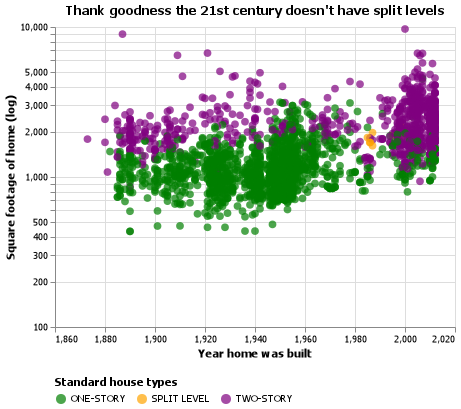
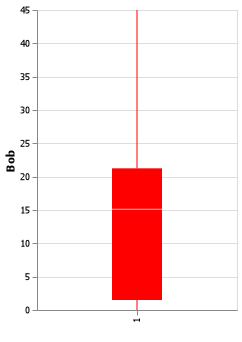

# Challenge 1
```python
import pandas as pd
import altair as alt
import numpy as np

from sklearn.model_selection import train_test_split
from sklearn import tree
from sklearn.ensemble import RandomForestClassifier
from sklearn import metrics
from sklearn.metrics import accuracy_score

url = 'https://github.com/byuidatascience/data4dwellings/raw/master/data-raw/dwellings_denver/dwellings_denver.csv'
dat_home = pd.read_csv(url).sample(n=4500, random_state=15)
```
# Challenge 1
```python
#Q1
dat2 = dat_home.query("arcstyle in ['ONE-STORY','SPLIT LEVEL','TWO-STORY']")

domain = ['ONE-STORY', 'SPLIT LEVEL', 'TWO-STORY']
range_ = ['green', 'orange', 'purple']

cc1 = alt.Chart(dat2).mark_circle(size=60).encode(
    x=alt.X('yrbuilt',
            scale=alt.Scale(domain=[1860, 2020]),
            title='Year home was built'),
    y=alt.Y('livearea',
            scale=alt.Scale(type="log"),
            title='Square footage of home (log)'),
    color=alt.Color('arcstyle',
            scale=alt.Scale(domain=domain, range=range_),
            legend=alt.Legend(orient='bottom'),
            title ='Standard house types')
).properties(
    title= {
      "text": ["Thank goodness the 21st century doesn't have split levels"],
    },
    width = 400)

cc1.save('cc1.png')

```


# Challenge 2
```python
#Q2
bob2 = pd.Series(['N/A', 15, 22, 45, 31, -999, 21, 2, 0, 0, 0, 'broken'])
bob2 = bob2.replace(['N/A','broken',-999],np.nan)
bob_sd = bob2.std()
```
StDev of bob is __16.143454125778383__

# Challenge 3
```python

#Q3
bob = pd.Series(['N/A', 15, 22, 45, 31, -999, 21, 2, 0, 0, 0, 'broken'])

bob = bob.replace(['N/A','broken',-999],np.nan)
bob = bob.fillna(bob.mean())

bob_df = bob.to_frame().assign(col2 = '1')

bob_df = bob_df.rename(columns={0: "col1"})

bob_pic = alt.Chart(bob_df).mark_boxplot(size=50, color = "red").encode(
    x = alt.X('col2',title = " "),
    y=alt.Y('col1:Q',title = "Bob"),
).properties(width=200)

bob_pic.save('bob_pic.png')
```


# Challenge 4
```python

#Q4

url = "http://byuistats.github.io/CSE250-Course/data/clean_starwars.csv"
dat = pd.read_csv(url)

dat = dat.replace(["Male","Female"],[1,0])

X_pred = dat.drop(columns = ['gender'])  
y_pred = dat['gender']
X_pred=X_pred.astype('int')
y_pred=y_pred.astype('int')

X_train, X_test, y_train, y_test = train_test_split(X_pred,y_pred,test_size=.20,random_state = 2022)   

clf = RandomForestClassifier(random_state=2022).fit(X_train, y_train)  # CREATE MODEL WITH TRAINING DATA

y_pred = clf.predict(X_test)    # TEST MODEL AND REPORT ACCURACY
score = accuracy_score(y_test, y_pred)
print(score)


feature_df = pd.DataFrame(
    {'features': X_train.columns,
    'importance': clf.feature_importances_})

best_features = feature_df.sort_values(['importance'],ascending = False).head(10).reset_index(drop=True)

best_features['importance'] = (round(best_features['importance']*100,2))

bf = alt.Chart(best_features).mark_bar().encode(
    x='importance',
    y=alt.Y('features', sort='-x')
)

bf.save('bf.png')
```
Accuracy Score = __0.5950920245398773__
