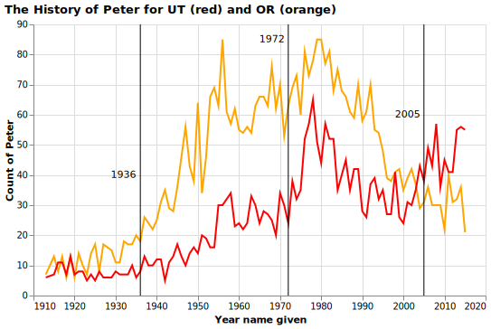

### CSE 250 Coding Challenge

Aj Averett

### Challenge Summary

This was an enjoyable set of challenges
#### Challenge 1

For this challenge, I gathered the data for 'Peter' based on Oregon and Utah. I then added extra elements as seen in the code below.

```python
all = ((peter_freq_chart_or + peter_freq_chart_ut + line_plot_1 + line_plot_2 + line_plot_3 + text1 + text2 + text3)
.properties(
    title= {
      "text": ["The History of Peter for UT (red) and OR (orange) "],
     #"subtitle": ['Super cool subtitle']
    },
    width = 500)
.configure_title(anchor='start'
))
```
##### Answer



#### Challenge 2

For this challenge, I was unable to finish, but I was able to have the data ready for a boxplot.


```python
temp = (temp['col1']
    .str.split('-', expand = True)
    .rename(columns={0: "col1",1: "col2"})
    .reset_index()
    )
```
##### Answer


#### Challenge 3

For this challenge, I replaced the lost values with NaN's and replaced them with 125. I then found the mean.


```python
mister[0] = (mister[0]
    .replace('lost',np.nan)
    .fillna(125)
)

reported_mean = round(mister[0].mean(), 2)
```
##### Answer

59.83

#### Challenge 4

For this challenge, I replaced the Gender column with numerical values. I then rand the GradientBoostingClassifier model.


```python
clf = GradientBoostingClassifier(random_state = 2020).fit(X_train, y_train)
)

...

best_features = feature_df.sort_values(['importance'],ascending = False).head(10).reset_index(drop=True)
```
##### Answer

Below are the 10 best features for predicting Gender with Star Wars data. This was 60.7 percent accurate.

|    | features                              |   importance |
|---:|:--------------------------------------|-------------:|
|  0 | rank__i__the_phantom_menace           |    0.0917625 |
|  1 | know_expanded_Yes                     |    0.073969  |
|  2 | rank__ii__attack_of_the_clones        |    0.0703866 |
|  3 | view__c-3p0_Very favorably            |    0.0693884 |
|  4 | age_min                               |    0.0379889 |
|  5 | rank__iv__a_new_hope                  |    0.0353637 |
|  6 | education                             |    0.0323401 |
|  7 | view__darth_vader_Very favorably      |    0.0321828 |
|  8 | rank__iii__revenge_of_the_sith        |    0.0315947 |
|  9 | view__anakin_skywalker_Very favorably |    0.0300529 |


### Appendix

```python
import pandas as pd
import altair as alt
import numpy as np

from sklearn.model_selection import train_test_split
from sklearn.metrics import accuracy_score
from sklearn.ensemble import GradientBoostingClassifier


# CHALLENGE ONE


gh_path = "https://github.com/byuidatascience/data4names/raw/master/data-raw"
url_names = gh_path + "/names_year/names_year.csv"
dat_names = pd.read_csv(url_names)

peter_freq_table = (dat_names[['name','year','UT','OR']]).query("name == 'Peter'")

# peter_freq_table.pivot_table(
#     #index = 'Region', 
#     columns = 'gadget_type',
#     aggfunc = 'size')

peter_freq_table_ut = (dat_names[['name','year','UT','OR']]
    .query("name == 'Peter' and UT > 0")
)

peter_freq_table_or = (dat_names[['name','year','UT','OR']]
    .query("name == 'Peter' and OR > 0")
)

peter_freq_chart_ut = (alt.Chart(
    peter_freq_table_ut,
    #title = "Frequency of the name Peter from 1910 to 2015"
    )
    .encode(
        x = alt.X(
            'year:Q',
            axis=alt.Axis(format='.4'),
            title = "Year name given"),
        y = alt.Y(
            'UT',
            #scale = alt.Scale(domain=[0, 10000]),
            title = "Count of Peter")
    )
    .mark_line(color="#ff0000")
)

peter_freq_chart_or = (alt.Chart(
    peter_freq_table_or,
    #title = "Frequency of the name Peter from 1910 to 2015"
    )
    .encode(
        x = alt.X(
            'year:Q',
            axis=alt.Axis(format='.4'),
            title = "Year name given"),
        y = alt.Y(
            'OR',
            #scale = alt.Scale(domain=[0, 10000]),
            title = "Count of Peter")
    )
    .mark_line(color="#ffa500")
)


line_plot_1 = (
alt.Chart(pd.DataFrame
    ({'x': [1936]}))
.mark_rule()
.encode(x='x'))

line_plot_2 = (
alt.Chart(pd.DataFrame
    ({'x': [1972]}))
.mark_rule()
.encode(x='x'))

line_plot_3 = (
alt.Chart(pd.DataFrame
    ({'x': [2005]}))
.mark_rule()
.encode(x='x'))

text1 = (
alt.Chart
    ({'values':[{'x': 1932, 'y': 40}]})
.mark_text(text='1936')
.encode(x='x:Q', y='y:Q'))

text2 = (
alt.Chart
    ({'values':[{'x': 1968, 'y': 85}]})
.mark_text(text='1972')
.encode(x='x:Q', y='y:Q'))

text3 = (
alt.Chart
    ({'values':[{'x': 2001, 'y': 60}]})
.mark_text(text='2005')
.encode(x='x:Q', y='y:Q'))

all = ((peter_freq_chart_or + peter_freq_chart_ut + line_plot_1 + line_plot_2 + line_plot_3 + text1 + text2 + text3)
.properties(
    title= {
      "text": ["The History of Peter for UT (red) and OR (orange) "],
     #"subtitle": ['Super cool subtitle']
    },
    width = 500)
.configure_title(anchor='start'
))

all.save('gq1.svg')


# CHALLENGE 2

ages = pd.Series(["10-25", "10-25", "26-35", "56-85", "0-9", "46-55","56-85", "0-9", "26-35", "56-85", "0-9", "10-25"])


temp = pd.DataFrame(ages).rename(columns={0: "col1"})

temp = (temp['col1']
    .str.split('-', expand = True)
    .rename(columns={0: "col1",1: "col2"})
    .reset_index()
    )

temp = alt.Chart(temp).mark_boxplot(extent='min-max').encode(
    y='index',
    x='col1:Q'
)


temp.save('temp.png')

# Challenge 3
mister = pd.Series(["lost", 15, 22, 45, 31, "lost", 85, 38, 129, 80, 21, 2])

mister = pd.DataFrame(mister).reset_index()

mister[0] = (mister[0]
    .replace('lost',np.nan)
    .fillna(125)
)

reported_mean = round(mister[0].mean(), 2)

#Challenge 4

url = "http://byuistats.github.io/CSE250-Course/data/clean_starwars.csv"
ml_chal = pd.read_csv(url)

ml_chal['gender'] = ml_chal['gender'].replace('Male',1)
ml_chal['gender'] = ml_chal['gender'].replace('Female',0)


X_pred = ml_chal.drop(columns = ['gender'])
y_pred = ml_chal['gender']

# SPLIT VARIABLES
X_train, X_test, y_train, y_test = train_test_split(X_pred,y_pred,test_size=.20,random_state = 2020)

# # CREATE MODEL WITH TRAINING DATA
clf = GradientBoostingClassifier(random_state = 2020).fit(X_train, y_train)

# # TEST MODEL AND REPORT ACCURACY
y_pred = clf.predict(X_test)
y_probs = clf.predict_proba(X_test)

score = accuracy_score(y_test, y_pred)


feature_df = pd.DataFrame(
    {'features': X_train.columns, 
    'importance': clf.feature_importances_})

best_features = feature_df.sort_values(['importance'],ascending = False).head(10).reset_index(drop=True)


```