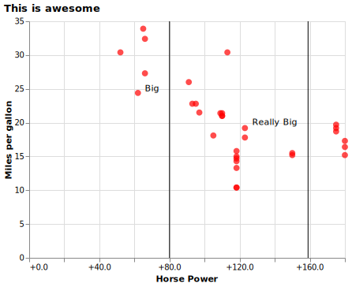

# Coding Challenge:  
## Practice Coding Challenge

### Name: _Your name here_

### Instructions

_In the Final Coding Challenge I will ask you to complete problems about as challenging as what is shown below.  Plus, you will need to fit a machine learning model with data I provide._

_Remember, you will only have 60 minutes to work on the challenge! You will not be able to complete every question perfectly, but you should spend at least a little time on each question._

_Paste your answers and code inside this `.md` file._

--- 

### Practice Challenges

Start by loading these packages and data:

```python

import pandas as pd
import altair as alt
import numpy as np

dat = pd.read_csv('https://github.com/byuidatascience/data4missing/raw/master/data-raw/mtcars_missing/mtcars_missing.csv')

```

<br>

**Question 1:** Try recreating the chart below using the [mtcars missing](https://github.com/byuidatascience/data4missing/raw/master/data-raw/mtcars_missing/mtcars_missing.csv) data that you've already loaded.

- Note that `hp` has missing values, and you will have to replace them with the mean.
- Please drop all cars with a missing name.


**Question 1 Answer:**


**Question 1 Code:**

```
import pandas as pd
import altair as alt

dat = pd.read_csv('https://github.com/byuidatascience/data4missing/raw/master/data-raw/mtcars_missing/mtcars_missing.csv')

dat1 = (dat
    .fillna(dat['hp'].mean())
    .dropna(subset=['car'])
)
#%%
chart = alt.Chart(dat1).mark_circle(size=60).encode(
    x = alt.X(
        'hp',
        title = "Horse Power",
        axis=alt.Axis(format='+.1f')
    ),
    y=alt.Y('mpg',title = "Miles per gallon"),
)

line_plot_1 = (
alt.Chart(pd.DataFrame
    ({'x': [80]}))
.mark_rule()
.encode(x='x'))

line_plot_2 = (
alt.Chart(pd.DataFrame
    ({'x': [159]}))
.mark_rule()
.encode(x='x'))

text1 = (
alt.Chart
    ({'values':[{'x': 70, 'y': 25}]})
.mark_text(text='Big')
.encode(x='x:Q', y='y:Q'))

text2 = (
alt.Chart
    ({'values':[{'x': 140, 'y': 20}]})
.mark_text(text='Really Big')
.encode(x='x:Q', y='y:Q'))

full = chart + line_plot_1+ line_plot_2 + text2 + text1

final = (full
    .configure_mark(color='red')
    .properties(
        title= {"text": ["This is awesome"],},
        width = 400)
    .configure_title(anchor='start'

final.save('temp_test.svg')
))

```

<br>

**Question 2:** Try writing code to recreate the following table.

- Have `cyl` on the rows and `carb` on the columns
- The values inside the table represent the number of cars with that particular `cyl`/`carb` combination.
- The `pd.crosstab()` function could be helpful, or maybe `pd.pivot_table()`.


|   cyl |   1 |   2 |   3 |   4 |   6 |   8 |
|------:|----:|----:|----:|----:|----:|----:|
|     4 |   5 |   6 |   0 |   0 |   0 |   0 |
|     6 |   2 |   0 |   0 |   4 |   1 |   0 |
|     8 |   0 |   4 |   3 |   6 |   0 |   1 |

**Question 2 Answer:**

|   cyl |   1 |   2 |   3 |   4 |   6 |   8 |
|------:|----:|----:|----:|----:|----:|----:|
|     4 |   5 |   6 |   0 |   0 |   0 |   0 |
|     6 |   2 |   0 |   0 |   4 |   1 |   0 |
|     8 |   0 |   4 |   3 |   6 |   0 |   1 |
**Question 2 Code:**

```

dat2 = (dat
    .filter(['cyl','carb'])
    .pivot_table(
        index = 'cyl', 
        columns = 'carb',
        aggfunc = 'size')
    .fillna(0)
)

print(dat2.to_markdown())
```


