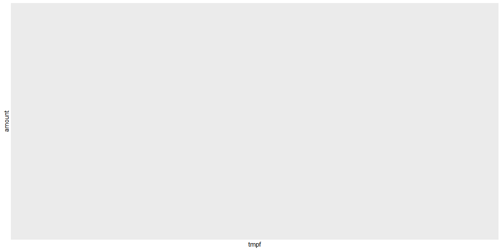

```r
library(tidyverse)
```

```
## -- Attaching packages --------------------------------------- tidyverse 1.3.1 --
```

```
## v ggplot2 3.3.5     v purrr   0.3.4
## v tibble  3.1.7     v dplyr   1.0.9
## v tidyr   1.2.0     v stringr 1.4.0
## v readr   2.1.2     v forcats 0.5.1
```

```
## -- Conflicts ------------------------------------------ tidyverse_conflicts() --
## x dplyr::filter() masks stats::filter()
## x dplyr::lag()    masks stats::lag()
```

```r
library(lubridate)
```

```
## 
## Attaching package: 'lubridate'
```

```
## The following objects are masked from 'package:base':
## 
##     date, intersect, setdiff, union
```

```r
library(nycflights13)
library(riem)

test<- read_csv('https://byuistats.github.io/M335/data/carwash.csv') %>%
  mutate(time = with_tz(time, tzone = "America/Denver")) %>% 
  mutate(time = force_tz(time, tzone = "Australia/Lord_Howe")) %>%
  mutate(time = ceiling_date(time, "hour")) %>% 
  group_by(time) %>% 
  mutate(amount = mean(amount)) %>%
  ungroup() %>% 
  select(c(time,amount)) %>% 
  distinct()
```

```
## Rows: 533 Columns: 4
```

```
## -- Column specification --------------------------------------------------------
## Delimiter: ","
## chr  (2): name, type
## dbl  (1): amount
## dttm (1): time
## 
## i Use `spec()` to retrieve the full column specification for this data.
## i Specify the column types or set `show_col_types = FALSE` to quiet this message.
```

```r
riem <- riem_measures(station = "RXE", date_start = date(min(test$time)),   date_end = date(max(test$time))) %>% 
  drop_na(tmpf) %>% 
  mutate(time = ceiling_date(valid,"hour")) %>% 
  group_by(time) %>% 
  mutate(tmpf = mean(tmpf)) %>%
  ungroup() %>% 
  select(c(time,tmpf)) %>% 
  distinct()

test %>% 
  inner_join(riem) %>% 
  ggplot(aes(x = tmpf, y = amount)) +
  geom_point() 
```

```
## Joining, by = "time"
```

<!-- -->

