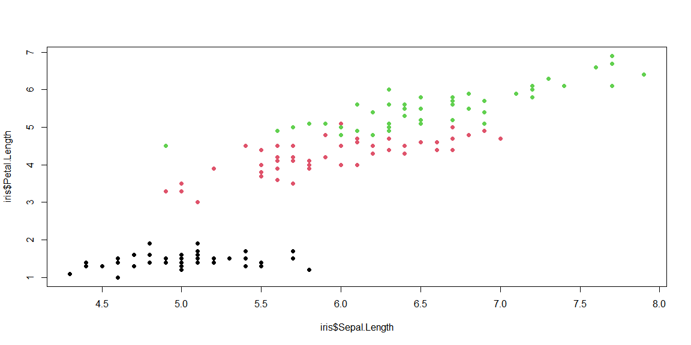

```r
knitr::opts_chunk$set(echo = TRUE, message = FALSE, warning = FALSE, error = TRUE)
#The error = TRUE option allows knitting even if there are errors. 
```

### Visualization
Below is a visualization of Mike Glennon's career earnings partitioned by team. 

{width=20%}
<br>

#### Visualization Review

<!-- Find an example of an article that uses data and visualizations to answer a question. Write a brief one paragraph review of the article.

- What is unique or good about the visualization? List a few ideas.
- What could be better? Identify at least one issue with the visualization. -->

This visualization is incredible because of its stark postmodern abstraction of the human condition. In regards to its ability to present data, however, it does not seem to be large enough to analyze. Additionally, it does not seem to display the partitioned earnings itself. If I were to improve this visualization, his neck would be much longer and it would be clearer and take up a higher percent of the screen.

The link to the image is  [here](https://twitter.com/betmgm/status/1472977046552956932).

<br>

### Testing

<!-- Create another section called “Testing.” In that section, add the R code below to your .Rmd file in an R chunk. The last line will produce an error (which it should). Leave the line as is, to verify that your file will knit even with an error in your work. -->

Below is code that plots the base R data set, iris. This is a scatter plot with the Sepal length and Petal length on the x and y axis respectively.


```r
plot(x = iris$Sepal.Length,
 y = iris$Petal.Length, 
 col = iris$Species, pch = 19)
```

<!-- -->

```r
plot(x,y) # <-- error
```

```
## Error in plot(x, y): object 'x' not found
```


