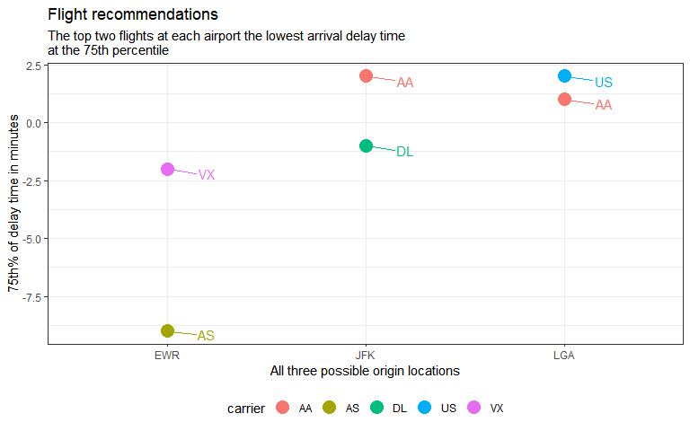
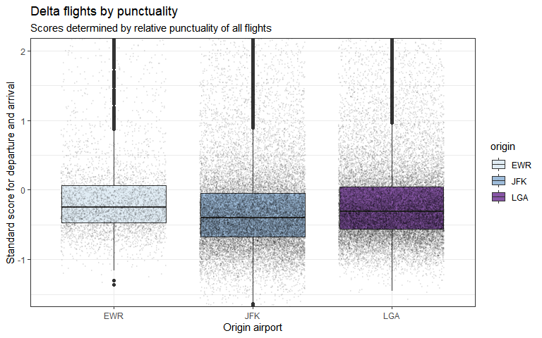
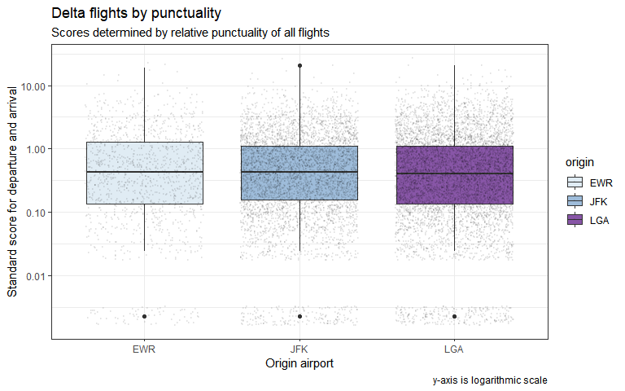
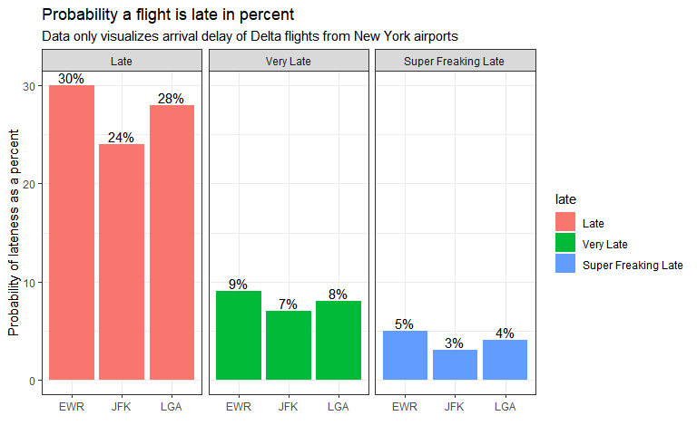

# Background data

The Bureau of Transportation Statistics released data regarding flights that departed New York City from either of its three airports, JFK, LGA, or EWR. The following questions will be regarding punctuality based on certain requirements. Throughout this report, visualizations and statistical analysis will be done in order to find optimal solutions for planning based on an arbitrary set of criteria.

<br>


```r
library(nycflights13)
library(tidyverse)
library(ggrepel)
```


# Managerial questions

**Question:**

*If I am leaving before noon, which two airlines do you recommend at each airport (JFK, LGA, EWR) that will have the lowest arrival delay time at the 75th percentile?*

<br>

Since the minimum and maximum arrival delay times could be skewed by a single flight and the median arrival delay time only helps us understand what happens with about 50% of flights, we can instead analyze the 75th percentile in order to make comparisons that take into account 75% of the flights. The code below will calculate the the lowest arrival delay times based on the 75th percentile of delay time and plot the top two flights at each origin airport.

<br>


```{.r .fold-hide}
#Task 2a

flights1 <- flights %>% 
  filter(sched_dep_time < 1200) %>% 
  filter(origin == 'EWR')

flights2 <- flights %>% 
  filter(sched_dep_time < 1200) %>% 
  filter(origin == 'LGA')

flights3 <- flights %>% 
  filter(sched_dep_time < 1200) %>% 
  filter(origin == 'JFK')

###

flights1a <- flights1 %>% 
  group_by(carrier) %>% 
  summarize(sfth = quantile(arr_delay, 0.75,na.rm = T)) %>% 
  mutate(origin = 'EWR') %>% 
  arrange(sfth) %>% 
  slice(1:2) 
  
flights2a <- flights2 %>% 
  group_by(carrier) %>% 
  summarize(sfth = quantile(arr_delay, 0.75,na.rm = T)) %>% 
  mutate(origin = 'LGA') %>% 
  arrange(sfth) %>% 
  slice(1:2) 

flights3a <- flights3 %>% 
  group_by(carrier) %>% 
  summarize(sfth = quantile(arr_delay, 0.75,na.rm = T)) %>% 
  mutate(origin = 'JFK') %>% 
  arrange(sfth) %>% 
  slice(1:2) 

all_flights <- bind_rows(flights1a,flights2a,flights3a)

all_flights %>% 
  ggplot(aes(
             x = fct_reorder(origin, sfth, .fun = mean),
             # x = fct_reorder(carrier, sfth, .fun = mean),
             y = sfth, 
             color = carrier,
             # color = origin,
             label = carrier
             )) +
  geom_point(size = 5) +
  #facet_grid(.~origin) +
  theme_bw() +
  geom_text_repel(nudge_x = .2, nudge_y = -.2) +
  labs(title = 'Flight recommendations',
       subtitle = 'The top two flights at each airport the lowest arrival delay time\nat the 75th percentile',
       x = 'All three possible origin locations',
       y = '75th% of delay time in minutes'
       ) +
  theme(legend.position = 'bottom')
```

<!-- -->


**Answer:** For each origin location, the graph shows three points for delay time at the 75th percentile.

-   For origin EWR, the least late carriers are AS and VX respectively.
-   For origin, LGA, the least late carriers are AA and US respectively.
-   For origin, JFK, the least late carriers are DL and AA respectively.

------------------------------------------------------------------------

**Question:**

*Which origin airport is best to minimize my probability of a late arrival when I am using Delta Airlines?*

<br>

The following code calculates a 'z-score' or standard score of departure and arrival time for all flights, then filters for Delta flights and groups by airport. From this, a box plot is used to display the general summary data for each flight. Additional jittered points are displayed on the plot for more understanding of the distribution of delay scores.

The higher the standard score, the more relatively and abnormally late, the lower the standard score, the the more relatively and abnormally early. Basically,a flight with a standard score of zero would be the most average delay time.

<br>


```r
deltadep <- flights %>% 
  mutate(zscore = (arr_delay - mean(arr_delay, na.rm = T))/sd(arr_delay, na.rm = T)) %>% 
  filter(carrier == 'DL') %>% 
  mutate(status = 'dep')
  
flights.delta <- deltadep %>% 
  select(c('carrier','origin','zscore','status'))

flights.deltaviz <- ggplot(data = flights.delta, aes(
    x = fct_reorder(origin, zscore, .fun = median),
    #x = origin,
    y = zscore,
    fill = origin)) +
  geom_boxplot() +
  theme_bw() +
  labs(
    x = 'Origin airport',
    y = 'Standard score for departure and arrival',
    title = 'Delta flights by punctuality',
    subtitle = 'Scores determined by relative punctuality of all flights'
  ) +
  scale_fill_brewer(palette = 3) +
  geom_jitter(color = "black",
              size = 0.3,
              alpha = 0.06,
              width = 0.38,
              height = 0.15) 


# mean(flights.delta$zscore, na.rm = TRUE) # Delta flights are not anomalous 

flights.deltaviz +
  coord_cartesian(ylim = c(-1.5,2))
```

<!-- -->

The code below visualizes the same data, but changes the y-scale to logarithmic in order to see all the data easily.


```r
flights.deltaviz  + scale_y_log10() + labs(caption = "y-axis is logarithmic scale")
```

<!-- -->


**Notes on visualization**

The above charts include the individual flights by small, slightly transparent dots. There is much utility in this decision to see if any of the data is abnormal. While box plots alone are very good at representing data that is normally distributed, it may not be so good for other, weirder distributions including multi-modal or uniform distributions. For example, we can see how right skewed the data is with the individual points and some bumps that show a group of early flights. Possible disadvantages come when the data visualization is not done properly.

---

In order to calculate the probability of a flight being late, I will be using a standard score. I will divide the answers into three categories:

* Late 

* Very Late

* [Super Freaking Late](https://en.wikipedia.org/wiki/Technical_definition)

The categories come from the standard score. If a flight's arrival delay is later than the average delay of other flights, it is considered "Late". If the delay is over a standard deviation later than other flights, it is very late. If it is greater than two standard deviations, it is super freaking late. 


```r
delta.z <- flights.delta %>% 
  mutate(
    late = case_when(
      zscore <= 0 ~ "l0",
      (zscore > 0 & zscore <= 1) ~ "l1",
      (zscore > 1 & zscore <= 2) ~ "l2",
      zscore > 2 ~ "l3",
    )) 

delta.jfk <- delta.z %>% 
  filter(origin == "JFK")

delta.jfk <- delta.jfk %>% 
  group_by(late) %>% 
  summarize(count = n()) %>% 
  mutate(freq = round(100*count/sum(count))) %>% 
  mutate(freq1 = lead(freq)) %>% 
  mutate(freq2 = lead(freq1)) %>% 
  mutate(
    frequency = case_when(
      late == "l1" ~ freq + freq1 + freq2,
      late == "l2" ~ freq + freq1,
      late == "l3" ~ freq,
    )) %>% 
  select(late, frequency) %>% 
  mutate(origin = "JFK")
 

View(delta.jfk)
  
delta.lga <- delta.z %>% 
  filter(origin == "LGA")

delta.lga <- delta.lga %>% 
  group_by(late) %>% 
  summarize(count = n()) %>% 
  mutate(freq = round(100*count/sum(count))) %>% 
  mutate(freq1 = lead(freq)) %>% 
  mutate(freq2 = lead(freq1)) %>% 
  mutate(
    frequency = case_when(
      late == "l1" ~ freq + freq1 + freq2,
      late == "l2" ~ freq + freq1,
      late == "l3" ~ freq,
    )) %>% 
  select(late, frequency) %>% 
  mutate(origin = "LGA")

delta.ewr <- delta.z %>% 
  filter(origin == "EWR")

delta.ewr <- delta.ewr %>% 
  group_by(late) %>% 
  summarize(count = n()) %>% 
  mutate(freq = round(100*count/sum(count))) %>% 
  mutate(freq1 = lead(freq)) %>% 
  mutate(freq2 = lead(freq1)) %>% 
  mutate(
    frequency = case_when(
      late == "l1" ~ freq + freq1 + freq2,
      late == "l2" ~ freq + freq1,
      late == "l3" ~ freq,
    )) %>% 
  select(late, frequency) %>% 
  mutate(origin = "EWR")

delta.late <- bind_rows(delta.ewr, delta.jfk, delta.lga) %>%
  drop_na() %>% 
  mutate(late = recode(late, l1 = 'Late', l2 = 'Very Late', l3 =  'Super Freaking Late' ))

delta.late$late <- factor(delta.late$late,levels = c('Late', 'Very Late', 'Super Freaking Late'))


ggplot(delta.late, aes(x = origin, y = frequency, fill = late)) +
  geom_col(position = 'dodge', stat = 'identity') +
  facet_grid(.~late) +
  theme_bw() +
  geom_text(aes(label = paste0(frequency,"%")), position = position_dodge(width = 0.9), vjust = -0.25) +
  labs(title = "Probability a flight is late in percent",
       subtitle = "Data only visualizes arrival delay of Delta flights from New York airports",
       y = "Probability of lateness as a percent",
       x = "")
```

<!-- -->

<br>

**Answer:** If we look at all Delta flights that are outbound from EWR, JFK, or LGA and compare standard scores from arrival delay times, we can discover that the origin airport with the lowest standard score is JFK. The probability for all three types of lateness is the JFK airport.


**Follow-up Answer:** Looking at the same analysis as above, we discover that the airport with the highest probability of being late is EWR.

---


