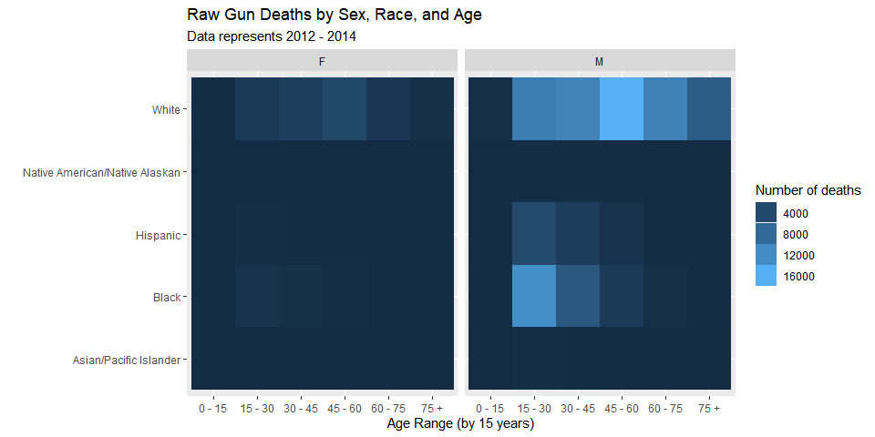
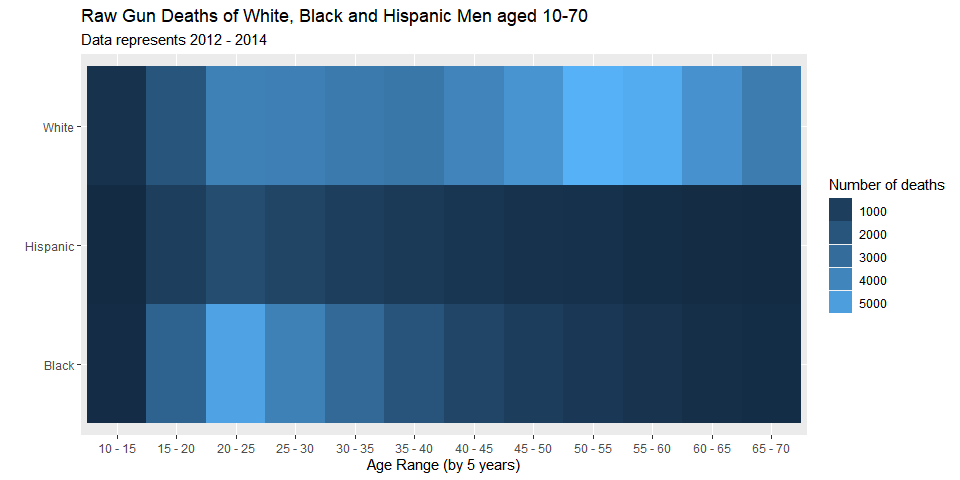
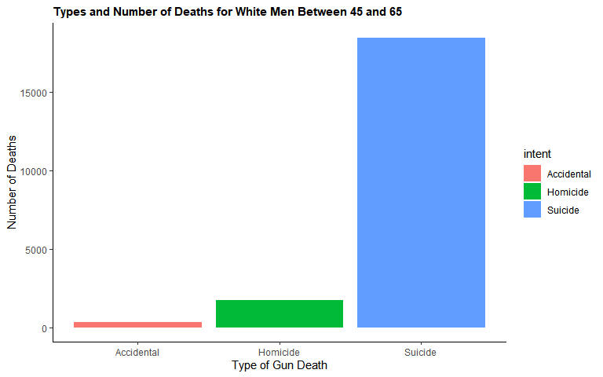
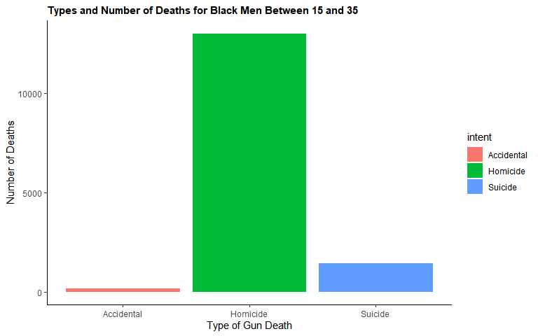
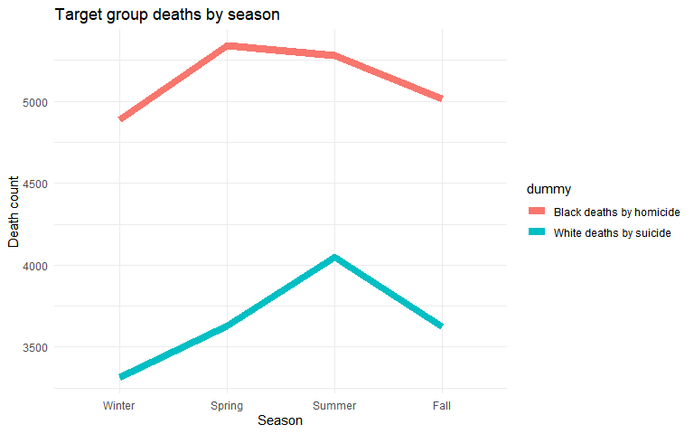
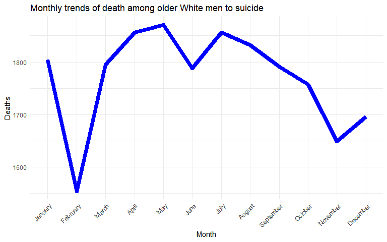
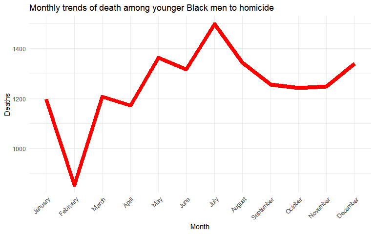

# Background data

FiveThirtyEight has compiled deaths by gun between 2012 and 2014 from various databases including the CDC’s Multiple Cause of Death database, the FBI's Uniform Crime Report, MotherJones’s database of public mass shootings, and the University of Maryland’s Global Terrorism Database. Using this compiled database of gun deaths, we can find groups that may be higher risk for a public awareness campaign. This includes data from intent, sex, age, rage, education, etc.

<br>
 
 

```r
#{r include=FALSE}

library(tidyverse)
library(treemap)
library(d3treeR)

guns <- read_csv('https://raw.githubusercontent.com/fivethirtyeight/guns-data/master/interactive_data.csv') %>% 
  na_if('None selected')

gunsfull <- read_csv('https://raw.githubusercontent.com/fivethirtyeight/guns-data/master/full_data.csv') 
```


## Initial chart
The chart below, similar to the FiveThirtyEight visualization, gives us insights to the racial breakdown of gun deaths according to each intent category. The following graph uses proportion to make these insights. In order to explore the data- click on each intent. To return to the previous level, Click on the bolded text on the top of the visualization.

<br>


```r
# Plot
g <- treemap(guns,
    index = c("Intent","Race"),
    vSize = "Deaths",
    title = "",
    palette = "Dark2",
    border.lwds = 1,                         
    fontsize.labels = 8.5,
    fontcolor.labels = "white",
    bg.labels = c("transparent"),              
    align.labels = c("left", "top"),                                  
    overlap.labels = 0.5,
    inflate.labels = T)  

h <- d3tree2(g, rootname = "Deaths by gun")
```


```{.r .fold-show}
h
```

```{=html}
<div id="htmlwidget-8f1e36aad9921f6f6922" style="width:768px;height:480px;" class="d3tree2 html-widget"></div>
<script type="application/json" data-for="htmlwidget-8f1e36aad9921f6f6922">{"x":{"data":{"name":"Deaths by gun","id":1,"size":null,"children":[{"name":"Accident","color":"#1B9E77","h":0.0649588836282083,"id":2,"size":2185,"stdErr":2185,"vColor":18,"vSize":2185,"w":0.125141511771613,"x0":0.626751838802927,"y0":0,"children":[{"name":"Asian/Pacific Islander","color":"#018E4D","h":0.00424694038579668,"id":3,"size":15,"stdErr":15,"vColor":18,"vSize":15,"w":0.0131402492337678,"x0":0.863780067106188,"y0":0},{"name":"Black","color":"#018E58","h":0.0607119432424117,"id":4,"size":436,"stdErr":436,"vColor":18,"vSize":436,"w":0.0267178104187177,"x0":0.838375585254237,"y0":0.00424694038579668},{"name":"Hispanic","color":"#018E64","h":0.0607119432424116,"id":5,"size":193,"stdErr":193,"vColor":18,"vSize":193,"w":0.0118269206670012,"x0":0.865093395672954,"y0":0.0042469403857967},{"name":"Other","color":"#018E70","h":0.00424694038579668,"id":6,"size":29,"stdErr":29,"vColor":18,"vSize":29,"w":0.0254044818519511,"x0":0.838375585254237,"y0":0},{"name":"White","color":"#018E7C","h":0.0649588836282083,"id":7,"size":1510,"stdErr":1510,"vColor":18,"vSize":1510,"w":0.0864822346796962,"x0":0.751893350574541,"y0":0}]},{"name":"Homicide","color":"#D95F02","h":0.467520558185896,"id":8,"size":46904,"stdErr":46904,"vColor":18,"vSize":46904,"w":0.373248161197073,"x0":0.626751838802927,"y0":0.532479441814104,"children":[{"name":"Asian/Pacific Islander","color":"#C33400","h":0.122957738773594,"id":9,"size":747,"stdErr":747,"vColor":18,"vSize":747,"w":0.0226023316157706,"x0":0.977397668384229,"y0":0.136560779701184},{"name":"Black","color":"#C34400","h":0.467520558185896,"id":10,"size":26015,"stdErr":26015,"vColor":18,"vSize":26015,"w":0.207019676648939,"x0":0.626751838802927,"y0":0.0649588836282083},{"name":"Hispanic","color":"#C35400","h":0.19455963484657,"id":11,"size":7511,"stdErr":7511,"vColor":18,"vSize":7511,"w":0.143626152932363,"x0":0.833771515451866,"y0":0.0649588836282083},{"name":"Other","color":"#C36500","h":0.0716018960729761,"id":12,"size":435,"stdErr":435,"vColor":18,"vSize":435,"w":0.0226023316157706,"x0":0.977397668384229,"y0":0.0649588836282083},{"name":"White","color":"#C37500","h":0.272960923339326,"id":13,"size":12196,"stdErr":12196,"vColor":18,"vSize":12196,"w":0.166228484548133,"x0":0.833771515451866,"y0":0.259518518474778}]},{"name":"Suicide","color":"#7570B3","h":0.93826574223573,"id":14,"size":84233,"stdErr":84233,"vColor":18,"vSize":84233,"w":0.333998808317435,"x0":0,"y0":0.0617342577642701,"children":[{"name":"Asian/Pacific Islander","color":"#595FA1","h":0.0617342577642701,"id":15,"size":992,"stdErr":992,"vColor":18,"vSize":992,"w":0.0597824830858177,"x0":0.522433816402171,"y0":0},{"name":"Black","color":"#5959A1","h":0.0617342577642701,"id":16,"size":4441,"stdErr":4441,"vColor":18,"vSize":4441,"w":0.267635088088827,"x0":0,"y0":0},{"name":"Hispanic","color":"#5E59A1","h":0.0617342577642701,"id":17,"size":4228,"stdErr":4228,"vColor":18,"vSize":4228,"w":0.254798728313344,"x0":0.267635088088827,"y0":0},{"name":"Other","color":"#6459A1","h":0.0617342577642701,"id":18,"size":739,"stdErr":739,"vColor":18,"vSize":739,"w":0.0445355393149388,"x0":0.582216299487988,"y0":0},{"name":"White","color":"#6A59A1","h":0.93826574223573,"id":19,"size":73831,"stdErr":73831,"vColor":18,"vSize":73831,"w":0.292753030485493,"x0":0.333998808317435,"y0":0.0617342577642701}]},{"name":"Unknown","color":"#E7298A","h":0.0649588836282083,"id":20,"size":1076,"stdErr":1076,"vColor":18,"vSize":1076,"w":0.0616257513346709,"x0":0.876920316339955,"y0":0,"children":[{"name":"Asian/Pacific Islander","color":"#D0038E","h":0.00287233158900244,"id":21,"size":13,"stdErr":13,"vColor":18,"vSize":13,"w":0.0168382629111461,"x0":0.983161737088854,"y0":0},{"name":"Black","color":"#D0037D","h":0.0368984134894925,"id":22,"size":167,"stdErr":167,"vColor":18,"vSize":167,"w":0.0168382629111461,"x0":0.983161737088854,"y0":0.0280604701387158},{"name":"Hispanic","color":"#D0036B","h":0.0251881385497134,"id":23,"size":95,"stdErr":95,"vColor":18,"vSize":95,"w":0.0140318857592884,"x0":0.983161737088854,"y0":0.00287233158900241},{"name":"Other","color":"#D0035A","h":0.0251881385497134,"id":24,"size":19,"stdErr":19,"vColor":18,"vSize":19,"w":0.00280637715185768,"x0":0.997193622848142,"y0":0.00287233158900244},{"name":"White","color":"#D00349","h":0.0649588836282083,"id":25,"size":779,"stdErr":779,"vColor":18,"vSize":779,"w":0.0446156694142274,"x0":0.938546067674626,"y0":0}]}]},"meta":{"type":"index","vSize":"Deaths","vColor":null,"stdErr":"Deaths","algorithm":"pivotSize","vpCoorX":[0.0246062992125984,0.975393700787402],"vpCoorY":[0.0196850393700787,0.980314960629921],"aspRatio":1.58360655737705,"range":null,"mapping":[null,null,null],"draw":true},"legend":null,"options":{"celltext":"name","id":"id","valueField":"size","clickAction":null}},"evals":[],"jsHooks":[]}</script>
```


# Exploratory data analysis
The following heat map will allow us to see which demographic groups by sex, race, or age group are likely to contribute heavily to the raw number of deaths by gun. The chart below compares age group separated by 15 year intervals and racial category faceted by sex. The lighter the blue color on the chart corresponds to a higher contribution to overall gun deaths.

<br>


```r
gunsfull1 <- gunsfull %>% 
  mutate(
    age_range = case_when(
      (age %in% c(0:14)) ~ "0 - 15",
      (age %in% c(15:30)) ~ "15 - 30",
      (age %in% c(30:45)) ~ "30 - 45",
      (age %in% c(45:60)) ~ "45 - 60",
      (age %in% c(60:75)) ~ "60 - 75",
      (age %in% c(75:200)) ~ "75 +",
    )
  ) %>% 
  filter(!is.na(age_range))


ggplot(gunsfull1, aes(x = age_range, y = race), stat = Rate) +
  geom_bin_2d() +
  facet_grid(.~sex) +
  labs(title = "Raw Gun Deaths by Sex, Race, and Age",
       subtitle = "Data represents 2012 - 2014",
       x = "Age Range (by 15 years)",
       y = "") +
  guides(fill = guide_legend(title = "Number of deaths"))
```

<!-- -->

<br>

## Posthoc refinement
Since the goal is to reduce raw gun deaths, the target population can be reduced to the following demographic categories:

* Sex: Males (M)
* Race: Whites, Blacks
* Age Group: 15-60ish

<br>


```r
gunsfull2 <- gunsfull %>% 
  filter(sex == "M") %>% 
  filter(age %in% c(10:69)) %>% 
  filter(race %in% c("White","Black","Hispanic")) %>% 
  mutate(
    age_range = case_when(
      (age %in% c(10:14)) ~ "10 - 15",
      (age %in% c(15:19)) ~ "15 - 20",
      (age %in% c(20:24)) ~ "20 - 25",
      (age %in% c(25:29)) ~ "25 - 30",
      (age %in% c(30:34)) ~ "30 - 35",
      (age %in% c(35:39)) ~ "35 - 40",
      (age %in% c(40:44)) ~ "40 - 45",
      (age %in% c(45:49)) ~ "45 - 50",
      (age %in% c(50:54)) ~ "50 - 55",
      (age %in% c(55:59)) ~ "55 - 60",
      (age %in% c(60:64)) ~ "60 - 65",
      (age %in% c(65:69)) ~ "65 - 70",
      )
  ) %>% 
  filter(!is.na(age_range))


ggplot(gunsfull2, aes(x = age_range, y = race), stat = Rate) +
  geom_bin_2d() +
  labs(title = "Raw Gun Deaths of White, Black and Hispanic Men aged 10-70",
       subtitle = "Data represents 2012 - 2014",
       x = "Age Range (by 5 years)",
       y = "") +
  guides(fill = guide_legend(title = "Number of deaths"))
```

<!-- -->

<br>


# Exploring target demographics

From the graph above, we can narrow down the target demographics of gun deaths to White males in their 50's and Black males in their 20's. For further analysis, Black men around their 20's and White men around their 50's will be analyzed to see how to best be targeted.

## White men around their 50's
From the chart below, we can understand that the majority of deaths for White men in their 50's are from suicide. 


```r
gunsfull3 <- gunsfull %>% 
  filter(sex == "M") %>% 
  filter(age %in% c(45:65)) %>% 
  filter(race == "White") %>% 
  na_if('Undetermined') %>% 
  drop_na()

gunsfull3 %>% 
  ggplot(aes(x = intent, fill = intent)) +
  geom_bar() +
  labs(x = "Type of Gun Death",
       y = "Number of Deaths",
       subtitle = "Types and Number of Deaths for White Men Between 45 and 65") +
  theme_classic() + theme(plot.subtitle = element_text(face = "bold"))
```

<!-- -->

## Black men around their 20's
From the chart below, we can understand that the majority of deaths for White men in their 20's are from homicide. 


```r
gunsfull4 <- gunsfull %>% 
  filter(sex == "M") %>% 
  filter(age %in% c(15:35)) %>% 
  filter(race == "Black") %>% 
  na_if('Undetermined') %>% 
  drop_na()

gunsfull4 %>% 
  ggplot(aes(x = intent, fill = intent)) +
  geom_bar() +
  labs(x = "Type of Gun Death",
       y = "Number of Deaths",
       subtitle = "Types and Number of Deaths for Black Men Between 15 and 35") +
  theme_classic() +  theme(plot.subtitle = element_text(face = "bold"))
```

<!-- -->

# Insights
From the information above, the two demographics that contribute most to raw gun deaths are White men in their 50's and Black men in their 20's. After further exploration, the cause of death between these groups are remarkably different. In White mean in their 50's, the primary cause of gun death was attributed to suicide. Black men in their 20's, conversely, die to guns most often from homicide. 


# Seasonal trends
Time of campaign is important since execution may be more effective during different seasons. A possible limitation for the following graphs is that they do not factor the fact that different seasons and months have different days. This being said, comparing patterns will still be valid since relative trends still happen against each other from the same scale of days.

```r
gunsfull3a <- gunsfull3 %>% 
  group_by(month) %>% 
  summarize(deaths = n()) %>% 
  mutate(
    season = case_when(
      month %in% c('12','01','02') ~ "Winter",
      month %in% c('03','04','05') ~ "Spring",
      month %in% c('06','07','08') ~ "Summer",
      month %in% c('09','10','11') ~ "Fall"
    )
  ) %>% 
  group_by(season) %>% 
  summarize(deaths = sum(deaths)) %>%  
  mutate(dummy = 'Black deaths by homicide') 

gunsfull4a <- gunsfull4 %>% 
  group_by(month) %>% 
  summarize(deaths = n()) %>% 
  mutate(
    season = case_when(
      month %in% c('12','01','02') ~ "Winter",
      month %in% c('03','04','05') ~ "Spring",
      month %in% c('06','07','08') ~ "Summer",
      month %in% c('09','10','11') ~ "Fall"
    )
  ) %>% 
  group_by(season) %>% 
  summarize(deaths = sum(deaths)) %>%  
  mutate(dummy = 'White deaths by suicide') 

gunsfull5 <- bind_rows(gunsfull3a, gunsfull4a)

gunsfull5$season <- factor(gunsfull5$season,levels = c("Winter", "Spring", "Summer", "Fall"))


ggplot(gunsfull5, aes(x = season, y = deaths, group = dummy, color = dummy)) +
  geom_line(size = 3) +
  theme_minimal() +
  labs(title = "Target group deaths by season",
       y = "Death count",
       x = "Season")
```

<!-- -->

From the visualization above, we can see that summer is a common season for suicides and spring is a common season for homicides among their respective demographics.


## Individual months with target demograhics


```r
gunsfull6a <- gunsfull %>% 
  filter(sex == "M") %>% 
  filter(age %in% c(45:65)) %>% 
  filter(race == "White") %>% 
  group_by(month) %>% 
  summarize(deaths = n()) %>%
  mutate(var = 'test',
        month = recode(month, '01' = 'January',
                      '02' = 'February',
                      '03' =  'March',
                      '04' =  'April',
                      '05' =  'May',
                      '06' =  'June',
                      '07' =  'July',
                      '08' =  'August',
                      '09' =  'September',
                      '10' =  'October',
                      '11' =  'November',
                      '12' =  'December',)
)

gunsfull6a$month <- factor(gunsfull6a$month,levels = c("January", 'February', 'March', 'April', 'May', 'June', 'July', 'August',  'September', 'October', 'November', 'December'))


ggplot(gunsfull6a, aes(x = month, y = deaths, group = var)) +
    geom_line(size = 3, color = "blue") +
    theme_minimal() +
    theme(axis.text.x = element_text(angle = 45, hjust = 1)) +
    labs(title = "Monthly trends of death among older White men to suicide",
         x = "Month",
         y = "Deaths")
```

<!-- -->

```r
gunsfull6b <- gunsfull %>%  
  filter(sex == "M") %>% 
  filter(age %in% c(15:35)) %>% 
  filter(race == "Black") %>% 
  group_by(month) %>% 
  summarize(deaths = n()) %>%
  mutate(var = 'test',
        month = recode(month, '01' = 'January',
                      '02' = 'February',
                      '03' =  'March',
                      '04' =  'April',
                      '05' =  'May',
                      '06' =  'June',
                      '07' =  'July',
                      '08' =  'August',
                      '09' =  'September',
                      '10' =  'October',
                      '11' =  'November',
                      '12' =  'December'))
        

gunsfull6b$month <- factor(gunsfull6b$month,levels = c("January", 'February', 'March', 'April', 'May', 'June', 'July', 'August',  'September', 'October', 'November', 'December'))


ggplot(gunsfull6b, aes(x = month, y = deaths, group = var)) +
    geom_line(size = 3, color = "red") +
    theme_minimal() +
    theme(axis.text.x = element_text(angle = 45, hjust = 1)) +
    labs(title = "Monthly trends of death among younger Black men to homicide",
         x = "Month",
         y = "Deaths")
```

<!-- -->

From the graphs above, we can learn that Spring and Summer months are more common for deaths- Spring more common for the older White suicide demographic and Summer for the other demographic. This may inform us better times to market anti-gun violence information.
