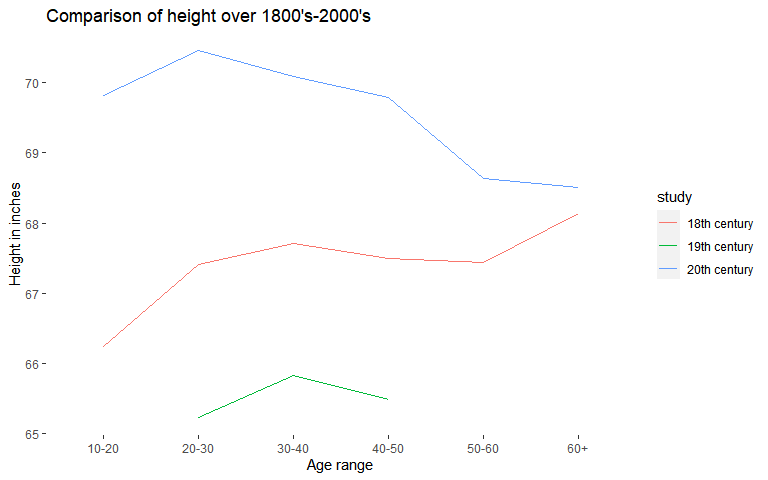
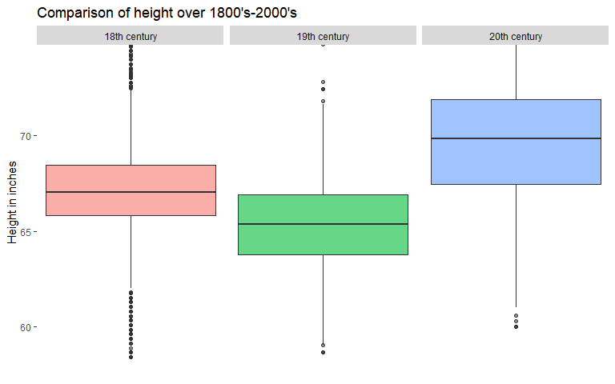
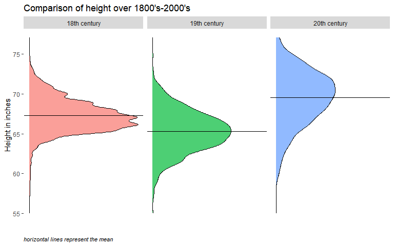

# Background data

The Scientific American argues that humans have been getting taller over the years. This project will attempt to validate this hypothesis by searching through various existing data sets with male heights from different years and countries. By combining these data sets, we will be able to compare heights among similar populations over time to see any trends.

The code below will load the packages and data that will be used throughout this projects analysis.


<br>    


```r
# library(rio)
library(tidyverse)
library(haven)
library(foreign)


# german soliders 19th century
g19raw <- read_dta('https://byuistats.github.io/M335/data/heights/germanconscr.dta')

# german prisoners 19th century
b19raw <-  read_dta('https://byuistats.github.io/M335/data/heights/germanprison.dta')

url <- "https://byuistats.github.io/M335/data/heights/Heights_south-east.zip"
temp <- tempfile()
download.file(url,temp)
g18raw <- read.dbf(unzip(temp, "B6090.DBF"))
unlink(temp)

# us bureau of labor statistics 20th century
us20raw <- read_csv('https://raw.githubusercontent.com/hadley/r4ds/main/data/heights.csv')

# university of wisconsin national survey data
w20raw <- read_sav('http://www.ssc.wisc.edu/nsfh/wave3/NSFH3%20Apr%202005%20release/main05022005.sav')
```

# Data Wrangling

In order for these data sets to be compared directly, they first must be analyzed and cleaned to match. For example, various data sets use metric while others use US customary. Some data sets did not explicitly have a birth year or an age column. Additionally, different columns had to be renamed for the bind_rows() command to work. Since the German data from before the 20th century is composed of virtually only White people, the BLS data is filtered as such. The Wisconsin survey, a longitudinal survey started in the late '80s, does not offer this racial filter and thus should be interpreted with caution. These data sets were also reordered so that the studies are presented chronologically. 

Since the mean and median age for these data sets are not the same, it would not make sense for them to be compared together since height changes over the time people age. In order to account for this, I added an additional column for the age or approximate the time the study was taken. This is created into an additional data set called, "alld.2040". 


```r
us20 <- us20raw %>% 
  filter(race == 'white') %>% 
  mutate(birth_year = 1991 - age) %>% 
  mutate(study = 'us20') %>% 
  rename(edu = ed) %>% 
  rename(income = earn) %>% 
  rename(height.in = height) %>% 
  filter(sex == 'male') %>% 
  select(-c(sex, income, edu, race)) %>% 
  mutate(height.cm = height.in*2.54) %>% 
  select(birth_year, height.in, height.cm, study, age)

g19 <- g19raw %>% 
  rename(birth_year = bdec) %>% 
  mutate(study = 'g19') %>% 
  mutate(height.in = height/2.54) %>% 
  select(-c(gebger, co,)) %>% 
  rename(height.cm = height) %>% 
  select(birth_year, height.in, height.cm, study, age)

b19 <- b19raw %>% 
  rename(birth_year = bdec) %>% 
  mutate(study = 'b19') %>% 
  mutate(height.in = height/2.54) %>% 
  select(-co) %>% 
  rename(height.cm = height) %>% 
  select(birth_year, height.in, height.cm, study, age)

g18 <- g18raw %>% 
  select(c(GEBJ, CMETER, SJ)) %>% 
  mutate(study = 'g18') %>% 
  mutate(height.in = CMETER/2.54) %>% 
  rename(birth_year = GEBJ) %>% 
  rename(height.cm = CMETER) %>% 
  mutate(age = SJ - birth_year) %>% 
  select(-SJ) %>% 
  select(birth_year, height.in, height.cm, study, age)

w20 <- w20raw %>% 
  mutate(birth_year = DOBY + 1900) %>% 
  mutate(age = 2002 - birth_year) %>%  #Wave 3 of NSFH was conducted 2001-2003
  select(c(birth_year, age, RT216F, RT216I, RE35)) %>% 
  filter(RE35 == 1) %>% 
  filter(RT216F >= 0) %>% 
  filter(RT216I >= 0) %>% 
  filter(RT216I <= 12) %>% 
  mutate(height.in = (RT216F*12) + RT216I) %>% 
  mutate(study = 'w20') %>% 
  select(-c(RT216F,RT216I, RE35)) %>% 
  mutate(height.cm = height.in*2.54) %>% 
  select(birth_year, height.in, height.cm, study, age)

alld <- bind_rows(b19, g18, g19, us20, w20)

alld$study <- factor(alld$study,
              levels = c("g18", "b19", "g19", "us20", "w20"))

alld.2040 <- alld %>% filter(age > 20 & age < 40)
```

# Visual analysis 
In order to get a first impression of the data, the following plot shows individual heights without summaries faceted by study.


```r
ggplot(alld, aes(y = height.in, x = birth_year, color = study)) + 
  geom_jitter(size = 0.4,
              alpha = 0.5,
              width = 3,
              height = 3,) +
  facet_grid(study~.) +
  theme_bw() +
  theme(plot.subtitle = element_text(lineheight = .5,
                                     size = 8,
                                     face = "italic")) +
  labs(x = "Birth year",
       y = "Height in inches",
       title = "Comparison of height over 1800's-2000's",
       subtitle = "g18 = South-east/west German soldiers born in the 18th century\n
b19 = Bavarian male oldiers, 19th century\n
g19 = German male soldiers in Bavaria, 19th century \n
us20 = US Bureau of Labor Statistics Height Data\n
w20 = National Survey of Families and Households",
  )
```

<!-- -->


The code below compares the individual heights across the 18th through 20th century. Because of the general groups this presents:

* A group in the 18th century (g18)
* A group in the 19th century (b19, g19)
* A group in the 20th century (us20, w20)

The remaining visualizations will group by these centuries.


```r
alld.century <- alld %>% 
  mutate(century = case_when(study == 'g18' ~ "18th century",
                               study == 'b19' ~ "19th century",
                               study == 'g19' ~ "19th century",
                               study == 'us20' ~ "20th century",
                               study == 'w20' ~ "20th century",
                               )) %>% 
  select(-study) %>% 
  rename(study = century)
```


# Analyzing trends by century
The plot below height by century over age ranges


```r
alld.range <- alld.century %>% 
  mutate(age_range = case_when(age %in% c(10:19) ~ "10-20",
                               age %in% c(20:29) ~ "20-30",
                               age %in% c(30:39) ~ "30-40",
                               age %in% c(40:49) ~ "40-50",
                               age %in% c(50:59) ~ "50-60",
                               age %in% c(60:200) ~ "60+",
                               )) %>%
  group_by(study, age_range) %>%
  summarize(average = mean(height.in, na.rm = TRUE)
  ) %>% 
  na.omit()

ggplot(alld.range, aes(x = age_range, y = average, color = study, group = study)) +
  geom_line() +
  theme(axis.line = element_line(colour = "white"),
        panel.border = element_blank(),
        panel.background = element_rect(fill = 'white')) +
  labs(x = "Age range",
       y = "Height in inches",
       title = "Comparison of height over 1800's-2000's")
```

<!-- -->

# Chronological comparison of height means and medians

The visualizations below compare centuries with height in inches. Both visualizations have a figure, either a box plot or a density curve, which represent a century.


```r
# Box plot
ggplot(alld.century, aes(y = height.in, fill = study)) +
  geom_boxplot(alpha = 0.6) +
  facet_grid(.~study) +
  theme(axis.line = element_line(colour = "white"),
        #panel.grid.major = element_blank(),
        #panel.grid.minor = element_blank(),
        panel.border = element_blank(),
        panel.background = element_rect(fill = 'white'),
        legend.position = "none",
        axis.ticks.x = element_blank(),
        axis.text.x = element_blank(),
        plot.subtitle = element_text(lineheight = .5,
                                     size = 8,
                                     face = "italic")) +
  labs(x = "",
       y = "Height in inches",
       title = "Comparison of height over 1800's-2000's",
       ) +
  coord_cartesian(ylim = c(59,74))
```

<!-- -->

```r
# Nose graph!
ggplot(alld.century, aes(y = height.in, fill = study)) +
  geom_density(alpha = 0.7) +
  geom_hline(
    data = . %>%
      group_by(study) %>%
      summarise(line = mean(height.in)),
    mapping = aes(yintercept = line)
  ) +
  facet_grid(.~study) +
  theme(axis.line = element_line(colour = "white"),
        #panel.grid.major = element_blank(),
        #panel.grid.minor = element_blank(),
        panel.border = element_blank(),
        panel.background = element_rect(fill = 'white'),
        legend.position = "none",
        axis.ticks.x = element_blank(),
        axis.text.x = element_blank(),
        plot.subtitle = element_text(lineheight = .5,
                                     size = 8,
                                     face = "italic"),
        plot.caption = element_text(hjust = 0,
                                     size = 8,
                                     face = "italic")) +
    labs(x = "",
       y = "Height in inches",
       title = "Comparison of height over 1800's-2000's",
       caption = "horizontal lines represent the mean") 
```

<!-- -->

# Elaboration

Interestingly, the data, shows a slight dip in the 19th century, but the shoots up in the 20th century. When comparing height from the earliest to latest data, there is an increase of a few inches. Limitations to this finding is that there were no filters in the w20 data set for race. Since there is evidence that Europeans on average are slightly taller than other races, this may underestimate the height gain from century to century. 

Other limitations include that there were no tests between means to determine statistical significance of this finding.

Overall, it does seem that human height has increased compared to previous centuries.


