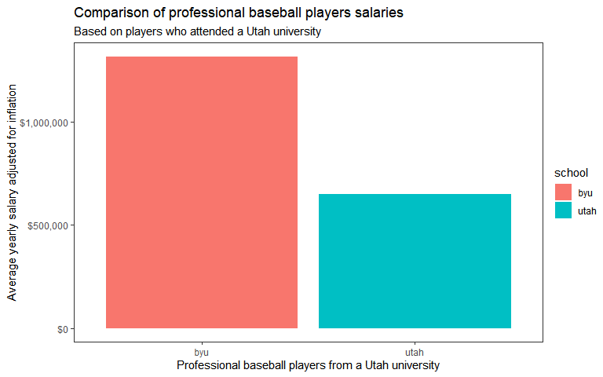
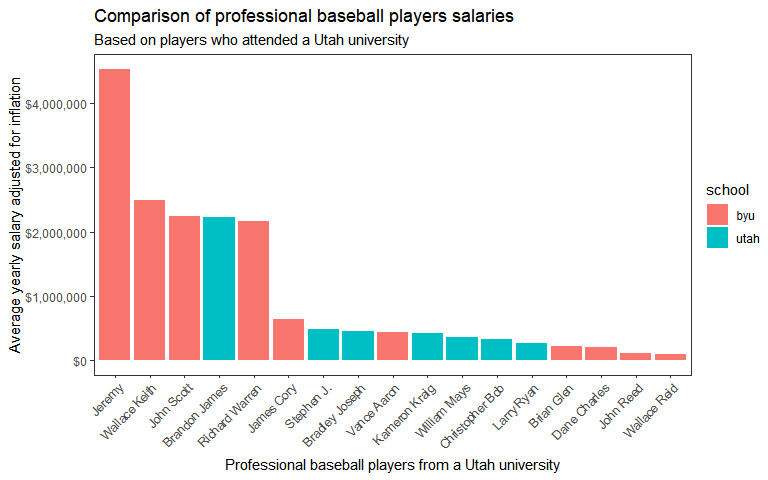
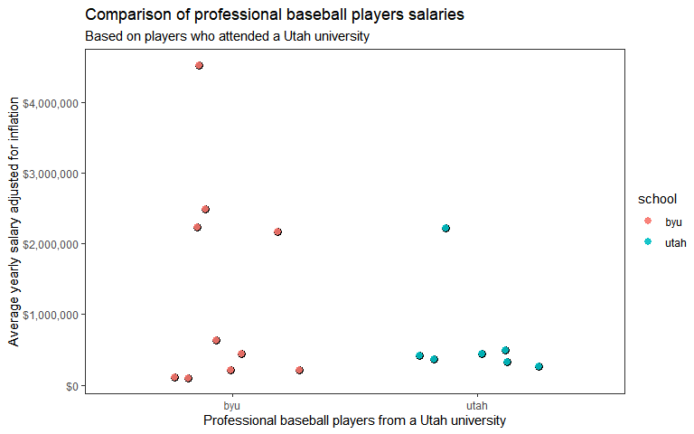
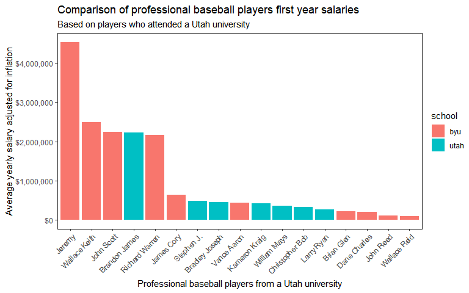

# Background data

Over the campfire, you and a friend get into a debate about which college in Utah has had the best MLB success. As an avid BYU fan, you want to prove your point, and you go to data to settle the debate. You need a clear visualization that depicts the performance of BYU players compared to other Utah college players that have played in the major leagues. The library(Lahman) package has a comprehensive set of baseball data. It is great for testing out our relational data skills. We will also need a function to adjust player salaries due to inflation, we’ll use library(priceR).

<br>    

Tables in which to be wrangled are found from the Lahman data set 


```r
library(Lahman)
library(tidyverse)
library(priceR)
library(pander)
library(effsize)
```


## Schools dataframe

```r
knitr::kable(slice_head(Schools, n = 3))
```


|schoolID   |name_full                    |city        |state |country |
|:----------|:----------------------------|:-----------|:-----|:-------|
|abilchrist |Abilene Christian University |Abilene     |TX    |USA     |
|adelphi    |Adelphi University           |Garden City |NY    |USA     |
|adrianmi   |Adrian College               |Adrian      |MI    |USA     |

## CollegePlaying dataframe

```r
knitr::kable(slice_head(CollegePlaying, n = 3))
```


|playerID  |schoolID | yearID|
|:---------|:--------|------:|
|aardsda01 |pennst   |   2001|
|aardsda01 |rice     |   2002|
|aardsda01 |rice     |   2003|

## Salaries dataframe

```r
knitr::kable(slice_head(Salaries, n = 3))
```


| yearID|teamID |lgID |playerID  | salary|
|------:|:------|:----|:---------|------:|
|   1985|ATL    |NL   |barkele01 | 870000|
|   1985|ATL    |NL   |bedrost01 | 550000|
|   1985|ATL    |NL   |benedbr01 | 545000|

## People dataframe

```r
knitr::kable(slice_head(People, n = 3))
```


|playerID  | birthYear| birthMonth| birthDay|birthCountry |birthState |birthCity | deathYear| deathMonth| deathDay|deathCountry |deathState |deathCity |nameFirst |nameLast |nameGiven   | weight| height|bats |throws |debut      |finalGame  |retroID  |bbrefID   |deathDate  |birthDate  |
|:---------|---------:|----------:|--------:|:------------|:----------|:---------|---------:|----------:|--------:|:------------|:----------|:---------|:---------|:--------|:-----------|------:|------:|:----|:------|:----------|:----------|:--------|:---------|:----------|:----------|
|aardsda01 |      1981|         12|       27|USA          |CO         |Denver    |        NA|         NA|       NA|NA           |NA         |NA        |David     |Aardsma  |David Allan |    215|     75|R    |R      |2004-04-06 |2015-08-23 |aardd001 |aardsda01 |NA         |1981-12-27 |
|aaronha01 |      1934|          2|        5|USA          |AL         |Mobile    |      2021|          1|       22|USA          |GA         |Atlanta   |Hank      |Aaron    |Henry Louis |    180|     72|R    |R      |1954-04-13 |1976-10-03 |aaroh101 |aaronha01 |2021-01-22 |1934-02-05 |
|aaronto01 |      1939|          8|        5|USA          |AL         |Mobile    |      1984|          8|       16|USA          |GA         |Atlanta   |Tommie    |Aaron    |Tommie Lee  |    190|     75|R    |R      |1962-04-10 |1971-09-26 |aarot101 |aaronto01 |1984-08-16 |1939-08-05 |

# Data Wrangling
To make the comparison of non-BYU Utah teams and BYU teams, my approach will be to find all observations of professional baseball players who have attended a Utah college and select all the respective rows including salary for each given year according to the time the player has been playing baseball. I then will average this data by person or school to make general comparisons between these groups.

* Step one of data wrangling to get a list of all schools in Utah.

* Step two is to get a record of all professional baseball players who have attended a Utah school that is not BYU. For those who have gone between schools, this will not matter as the data set treats non-BYU Utah schools as one entity. If you have attended a non-BYU Utah school, you will be part of this list. This list includes salary data for each year they have received salary.

* Step three is to create a similar record to step two, but instead, have the members of the list be from BYU.


* Step four is to combine the records from step two and three and create an additional column that adjusts the original salary data into 2020 dollars according to inflation.

* Step five is to see the average earnings by player from each year he earned a salary. This is done while adding a name column to see the baseball player's name- rather than an ID.


```r
#Step One
utahrows <- Schools %>% 
  filter(state == 'UT')

#Step Two
utahplayers <- CollegePlaying %>% 
  filter(schoolID %in% utahrows$schoolID) %>% 
  filter(schoolID != "byu") %>% 
  mutate(school = 'utah') %>% 
  select(-c(schoolID,yearID)) %>% 
  distinct() %>% 
  left_join(Salaries) %>% 
  filter(!is.na(salary)) %>% 
  select(playerID, school, yearID, salary)

#Step Three
byuplayers <- CollegePlaying %>% 
  filter(schoolID == "byu") %>% 
  select(-yearID) %>% 
  rename(school = schoolID) %>% 
  distinct() %>% 
  inner_join(Salaries) %>% 
  select(playerID, school, yearID, salary)

#Step Four
allplayers <- bind_rows(utahplayers, byuplayers) %>% 
  mutate(adjsal = adjust_for_inflation
            (price = salary,
              from_date = yearID,
              country = "US", to_date = 2020)) 

#Step Five
allsalary <- allplayers %>% 
  group_by(playerID) %>% 
  mutate(adjsal = mean(salary)) %>% 
  left_join(People) %>% 
  ungroup() %>% 
  select(nameGiven, school, yearID, adjsal) %>%  #View() #row = year obs of player
  group_by(nameGiven) %>% 
  mutate(adjavgsalperyr = mean(adjsal)) %>% 
  distinct(nameGiven, school, adjavgsalperyr) #%>% View() #row = avg yr salary/player
```


<br>

# Analyzing the difference by school

To directly answer the question. Below is a clear visualization that depicts the performance of BYU players compared to other Utah college players that have played in the major leagues.


```r
allsalary %>% 
  group_by(school) %>% 
  summarize(meansal = mean(adjavgsalperyr)) %>% #View()
ggplot(aes(x = school, y = meansal, fill = school)) +
  geom_col() +
  scale_y_continuous(labels = scales::dollar_format()) +
  labs(title = "Comparison of professional baseball players salaries",
       subtitle = "Based on players who attended a Utah university",
       x = "Professional baseball players from a Utah university",
       y = "Average yearly salary adjusted for inflation") +
  theme_test() 
```

<!-- -->


# Utah college players
Below is a vosialization that breaks down the previous visualization by individual players.


```r
allsalary %>% 
  ggplot(aes(x = fct_rev(fct_reorder(nameGiven, adjavgsalperyr, .fun = mean)), y = adjavgsalperyr, fill = school)) +
  geom_col() +
  scale_y_continuous(labels = scales::dollar_format())+
  labs(title = "Comparison of professional baseball players salaries",
       subtitle = "Based on players who attended a Utah university",
       x = "Professional baseball players from a Utah university",
       y = "Average yearly salary adjusted for inflation") +
  theme_test() +
  theme(axis.text.x = element_text(angle = 45, hjust = 1))
```

<!-- -->


```r
w.var <- .3

allsalary %>% 
  ggplot(aes(x = school, y = adjavgsalperyr, color = school)) +
  geom_point(position = position_jitter(seed = 5, w = w.var),
             color = 'black',
             size = 3,
             alpha = .9) +
  geom_point(position = position_jitter(seed = 5, w = w.var),
             size = 2.5,
             alpha = .9) +
  scale_y_continuous(labels=scales::dollar_format())+
  labs(title = "Comparison of professional baseball players salaries",
       subtitle = "Based on players who attended a Utah university",
       x = "Professional baseball players from a Utah university",
       y = "Average yearly salary adjusted for inflation") +
  theme_test() 
```

<!-- -->

# Analyzing the first year salary between players
Since it could be problematic that players can potentially earn more as they play for longer, the following code only looks at first year salaries.


```r
allsalary1 <- allplayers %>% 
  group_by(playerID) %>% 
  mutate(adjsal = mean(salary)) %>% 
  left_join(People) %>% 
  ungroup() %>% 
  select(nameGiven, school, yearID, adjsal) %>% 
  group_by(nameGiven) %>% 
  slice_head() 
  

allsalary1 %>% 
  group_by(school) %>% 
  summarize(meansal = mean(adjsal)) %>% 
ggplot(aes(x = school, y = meansal, fill = school)) +
  geom_col() +
  scale_y_continuous(labels = scales::dollar_format()) +
  labs(title = "Comparison of professional baseball players first year salaries",
       subtitle = "Based on players who attended a Utah university",
       x = "Professional baseball players from a Utah university",
       y = "Average yearly salary adjusted for inflation") +
  theme_test() 
```

<!-- -->

```r
allsalary1 %>% 
  ggplot(aes(x = fct_rev(fct_reorder(nameGiven, adjsal, .fun = mean)), y = adjsal, fill = school)) +
  geom_col() +
  scale_y_continuous(labels = scales::dollar_format())+
  labs(title = "Comparison of professional baseball players first year salaries",
       subtitle = "Based on players who attended a Utah university",
       x = "Professional baseball players from a Utah university",
       y = "Average yearly salary adjusted for inflation") +
  theme_test() +
  theme(axis.text.x = element_text(angle = 45, hjust = 1))
```

<!-- -->

<br>
from the visualizations above, we can see that the data and charts looks very similar to the previous ones indicating that only looking at the first year may be redundant.


# Statistical test

## Calculating significance with a Mann-Whitney test

```r
pander(
wilcox.test(adjavgsalperyr ~ school, data = allsalary, mu = 0, alternative = 'greater', conf.level = 0.95)
)
```


---------------------------------------------------
 Test statistic   P value   Alternative hypothesis 
---------------- --------- ------------------------
       37         0.4434           greater         
---------------------------------------------------

Table: Wilcoxon rank sum exact test: `adjavgsalperyr` by `school`

## Calculating an effect size between salaries of schools

```r
pander(
cohen.d(adjavgsalperyr ~ school,
        data = allsalary,
        hedges.correction = TRUE)
)
```


  * **method**: Hedges's g
  * **name**: g
  * **J**: _0.9492_
  * **estimate**: _0.5127_
  * **sd**: _1232359_
  * **conf.int**:

    -----------------
      lower    upper
    --------- -------
     -0.5001   1.525
    -----------------

  * **var**: _0.2258_
  * **conf.level**: _0.95_
  * **magnitude**: _3_

<!-- end of list -->

Assuming that I performed this Mann-Whitney test with two independent samples correctly, BYU's higher mean salary is not significant.

# Conclusion

From the visualizations, it is abundantly clear that BYU-educated baseball players make more money at baseball even when only looking at the first year. While this finding doesn't seem to be significant, the effect size is quite large (hedge's g = 0.51) which may indicate that the small sample is the only thing preventing this finding from being significant.

Though I am "an avid BYU fan", only the visualizations back up my claim and not necessarily the data.
