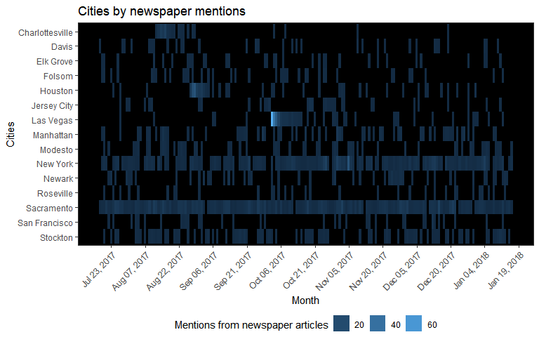
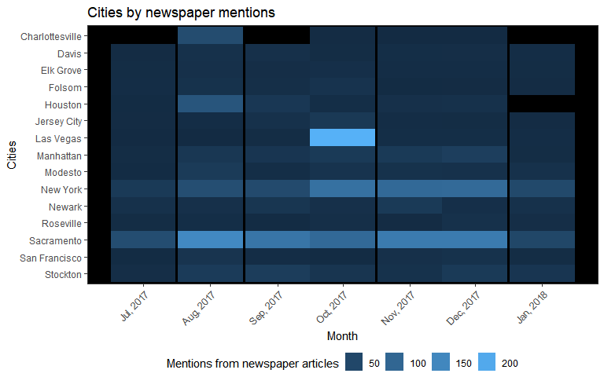
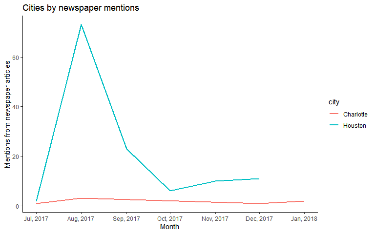

# Background data

This report will explore the frequency in which a city appears in news headlines. This will be a contributing factor to their city rankings. Using a California (KCRA) and a New York (ABC7NY) newspaper spanning July 18, 2017 - Jan 16, 2018, this report will use the headlines to find which cities are mentioned most in the news.

<br>    

## Loading in the data

The code below will load in the data.

```r
library(tidyverse)
library(maps)
library(lubridate)

news <- bind_rows(read_csv("https://storybench.org/reinventingtv/abc7ny.csv"), 
                  read_csv("https://storybench.org/reinventingtv/kcra.csv"))
```

## Sorting the data

The code below will analyze how many times a city is mentioned in a headline. For the top 15 cities, these are somewhat curated in order to not allow extraneous matches. For example, "Moore, Oklahoma" extraneously matches headlines related to "Roy Moore", especially since the allegations of sexual misconduct were during this time frame. Problems still occur occasionally in the data. If there are duplicate city names, the code cannot distinguish from which state the city is coming from. For example, "Manhattan, New York" and "Manhattan, Kansas" are not differentiated. 


```r
sorted_news <- news |> 
  mutate(city = str_extract(headline, pattern = (
      us.cities |> 
      mutate(citynames = str_sub(name, 1, -4) ) |> 
      select(-c(lat, long, capital, name)) |>  
      #filter(!country.etc %in% c("CA", "NY"),
      #       !citynames == "Manhattan") |> 
      select(citynames, country.etc) |>  
      mutate(length = str_length(citynames)) |>
      select(-country.etc) |> 
      distinct() |> 
      arrange(desc(length)) |> 
      select(-length) |> 
      pull(citynames) |> 
      str_c(collapse = "|") |> 
      str_replace("Sandy\\|", "(?<!Superstorm )Sandy(?! Kenyon)(?! Hook)|") |> 
      str_replace("Moore\\|", "(?<!Roy )(?<!Brian )(?<!Bud )(?<!Tyler )(?<!Mandy )Moore|") |> 
      str_replace("Davis\\|", "(?<!Viola )(?<!Kim )Davis|") |> 
      str_replace("Clinton\\|", "(?<!Bill )(?<!Hillary )(?<!Chelsea )Clinton(?! Foundation)[^s]|") |> 
      str_replace_all("Columbus\\|", "(?<!Christopher )Columbus(?! statue(s?))(?! Day)(?! Circle)|") |> 
      str_replace_all("Taylor\\|", "(?<!Will )Taylor(?! Swift)|") |> 
      str_replace_all("Union\\|", "Union(?! Square)(?!dale)|") |> 
      str_replace_all("Lincoln\\|", "Lincoln(?! Memorial)(?! Center)|") |> 
      str_replace_all("\\|Charlotte\\|", "|Charlottesville|Charlotte|")
      ) 
  )) |> 
  na.omit() |> 
  mutate(datetime = datetime |> str_sub(1,-12)) |> 
  mutate(datetime = mdy(datetime))
  

news_top <- sorted_news |> 
  count(city) |> 
  na.omit() |> 
  arrange(desc(n)) |> 
  head(15) 
```

We can see the cities mentioned most in the newspaper.

```r
news_top |> 
  ggplot(aes(x = fct_reorder(city, n) |> fct_rev(), y = n)) + 
  geom_col(fill = "blue") + 
  theme_classic() +
  labs(x = "City name",
       y = "Mentions from newspaper articles",
       title = "Cities by newspaper mentions") +
  theme(axis.text.x = element_text(angle = 45, vjust = 0.5, hjust = 0.5)) 
```

<!-- -->

## Tracking city popularity over time

The code below graphs the time the city was mentioned by day- the lighter the color, the more mentions. The charts are grouped by day...


```r
sorted_news |> 
  filter(city %in% (news_top |> pull(city))) |> 
  mutate(url = 1) |> 
  group_by(month = lubridate::floor_date(datetime, "day"), city) |>
  summarize(total = sum(url)) |> 
  ggplot(aes(x = month, y = fct_relevel(city) |> fct_rev(), fill = total)) +
  geom_tile() +
  theme_test() +
  theme(panel.background = element_rect(fill = 'black', color = 'gray'),
        axis.text.x = element_text(angle = 45, vjust = 1, hjust = 1),
        legend.position = "bottom"
        ) +
  scale_x_date(date_labels = "%b %d, %Y", date_breaks = "15 days") +
  labs(x = "Month",
       y = "Cities",
       title = "Cities by newspaper mentions"
       ) + guides(fill = guide_legend(title = "Mentions from newspaper articles"))
```

<!-- -->

... and by month

```r
sorted_news |> 
  filter(city %in% (news_top |> pull(city))) |> 
  mutate(url = 1) |> 
  group_by(month = lubridate::floor_date(datetime, "month"), city) |>
  summarize(total = sum(url)) |> 
  ggplot(aes(x = month, y = fct_relevel(city) |> fct_rev(), fill = total)) +
  geom_tile() +
  theme_test() +
  theme(panel.background = element_rect(fill = 'black', color = 'gray'),
        axis.text.x = element_text(angle = 45, vjust = 1, hjust = 1),
        legend.position="bottom") +
  scale_x_date(date_labels = "%b, %Y", date_breaks = "1 month") +
  labs(x = "Month",
       y = "Cities",
       title = "Cities by newspaper mentions"
       ) + guides(fill = guide_legend(title = "Mentions from newspaper articles"))
```

<!-- -->

Trends I can access from this data include the following:

* The boroughs from New York and cities near and including California are over-represented since the headlines come from a New York and California newspaper.

* The large spike in headlines from Las Vegas near October occurs because of the Las Vegas shooting, the most deadly mass shooting in American history.

* The large spike in headlines from Houston near August 2017 occurs because of Hurricane Harvey, it was the costliest natural disaster recorded in Texas at the time.

* The large spike in headlines from New York near November 2017 occurs because of the 2017 New York City truck attack on Oct 31st.

* The large spike in headlines from Charlottesville near August 2017 occurs because of the "Unite the Right" rally.


## Houston and Charlotte

Below is a graph comparing the headlines generated about Houston, TX and Charlotte, NC over time (by month). There is virtually nothing from Charlotte. Houston spikes in August 2017 due to Hurricane Harvey.


```r
sorted_news |> 
  filter(city %in% c('Houston','Charlotte')) |> 
  mutate(url = 1) |> 
  group_by(month = lubridate::floor_date(datetime, "month"), city) |>
  summarize(total = sum(url)) |> 
  ggplot(aes(x = month, y = total, color = city)) +
  geom_line(size = 1) + theme_classic() +
  scale_x_date(date_labels = "%b, %Y", date_breaks = "1 month") +
  labs(x = "Month",
       y = "Mentions from newspaper articles",
       title = "Cities by newspaper mentions"
       ) 
```

<!-- -->


