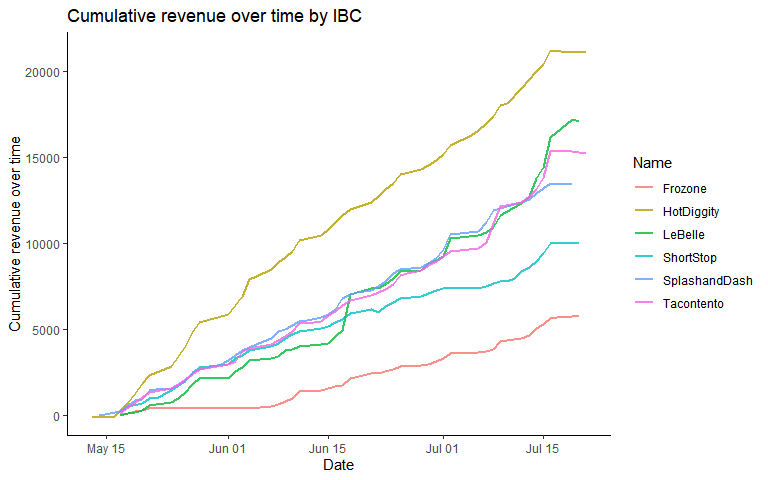
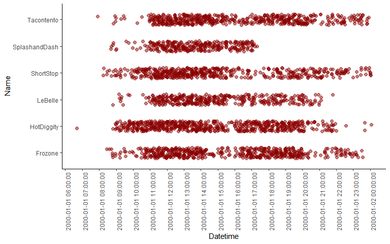
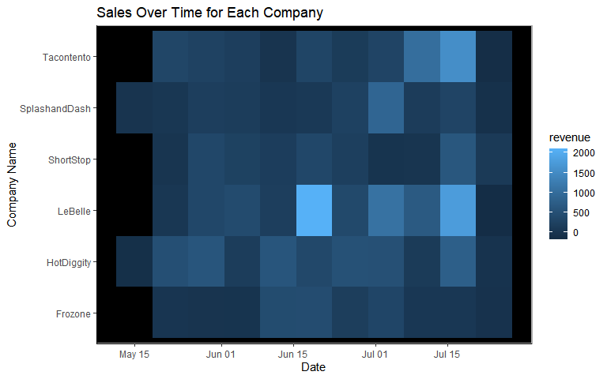
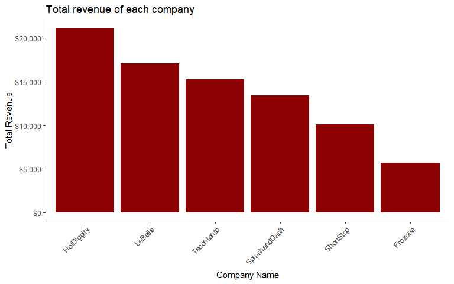

# Background data

We have transaction data for a few businesses that have been in operation for three months. Each of these companies has come to your investment company for a loan to expand their business. Your boss has asked you to go through the transactions for each business and provide daily, weekly, and monthly gross revenue summaries and comparisons. Your boss would like a short write up with tables and visualizations that help with the decision of which company did the best over the three month period. You will also need to provide a short paragraph with your recommendation after building your analysis.


<br>    

## Loading in the data

The code below will load in the data. The data has time recorded in UTC, but come from businesses in the mountain time zone. The code below makes sure to convert. 


```r
library(tidyverse)
library(lubridate)

sales <- read_csv("https://byuistats.github.io/M335/data/sales.csv") |> 
  mutate(Time = with_tz(Time, tzone = "America/Denver"),
    month = month(Time),
    day = day(Time),
    hour = hour(Time),
    minutes = minute(Time),
    date = as_date(Time)) |> 
  filter(Name != 'Missing') |> 
  mutate(date = date |> as.character(),
    date = recode(date, "2016-04-20" = "2016-05-12"),
    date = ymd(date))
```

#Cumulative revenue over time

This data visualization below provides a visualization that show gross revenue over time for each company. This aggregates over the daily level.

```r
sales  |>
  group_by(Name, date) |> 
  summarise(revenue = sum(Amount)) |> 
  mutate(date = ceiling_date(date, "day")) |> 
  group_by(Name, date) |> 
  summarize(week.revenue = sum(revenue)) |> 
  ungroup() |> 
  group_by(Name) |> 
  mutate(csum = cumsum(week.revenue)) |> 
  ggplot(aes(x = date, y = csum, color = Name)) +
  geom_line(size = 1, alpha = .8) +
  theme_classic() +
  labs(x = "Date",
       y = "Cumulative revenue over time",
       title = "Cumulative revenue over time by IBC")
```

<!-- -->
We can infer that Hot Diggity made the most cumulative revenue

# Visualization of hours of operations 

The visualization below provides insight into the hours of operation for each company.


```r
sales2 <- sales  |>
  select(Name, hour, minutes, Amount) |> 
  mutate(
    minutes = case_when(
        minutes %in% 0:9 ~ str_c('0',minutes),
        TRUE ~ str_c(minutes)),
    hour = case_when(
        hour %in% 0:9 ~ str_c('0',hour),
        TRUE ~ str_c(hour)),
    meridiem = case_when(
        hour %in% 1:11 ~ "AM",
        hour %in% 12:23 ~ "PM",
        TRUE ~ "AM"),
    hour = hour |> as.numeric(),
    hour = case_when(
        hour %in% 13:23 ~ str_c(hour-12),
        TRUE ~ str_c(hour))
    ) |> 
  mutate(Datetime = str_c("01/01/2000 ", hour,":",minutes,":00 ",meridiem)) |> #View()
  # mutate(Datetime1 = as_datetime(Datetime)) |> View()
  mutate(Datetime = as.POSIXct(Datetime, format="%m/%d/%Y %I:%M:%S %p")
) |> 
  group_by(Name, Datetime) |>
  summarise(revenue = mean(Amount)) |>
  mutate(Datetime = ceiling_date(Datetime, "15 minutes"))

sales2 |> 
  ggplot(aes(x = Datetime, y = Name)) +
  geom_jitter(alpha = .5, size = 2, height = .2, color = "darkred") +
  theme_classic() +
  scale_x_datetime(breaks = "hour", 
                   #labels = "%I %p"   # NOT WORKING
                   ) +
  theme(axis.text.x = element_text(angle = 90))
```

<!-- -->
From this visualization, we can infer that no company opens before 8 AM and closes later than 2 PM.

# Customer Traffic

Below is a visualization on customer traffic for each company measured in sales.


```r
sales1 <- sales  |>
  group_by(Name, date) |> 
  summarise(revenue = sum(Amount)) |> 
  mutate(date = ceiling_date(date, "week")) 

sales1 %>% 
  ggplot(aes(x = date, y = Name, fill = revenue)) +
  geom_tile() +
  theme_classic()+
  theme(panel.background = element_rect(
    fill = "black",
    colour = "darkgray",
    size = 1, 
    linetype = "solid"),
  ) +
  labs(title = 'Sales Over Time for Each Company',
       x = "Date",
       y = "Company Name") #+ facet_wrap(.~Name, scales = 'free')
```

<!-- -->
This data is aggregated over week.

# Choosing a company

Below is a visualization that compares the total revenue for each company.


```r
sales |> 
  group_by(Name) |> 
  summarize(total = sum(Amount)) |> 
  ggplot(aes(x = fct_reorder(Name, total) |> fct_rev(), y = total)) + 
  geom_col(fill = "darkred") +
  labs(x = "Company Name",
       y = "Total Revenue",
       title = "Total revenue of each company") +
  scale_y_continuous(labels=scales::dollar_format()) +
  theme_classic() + theme(axis.text.x = element_text(angle = 45, vjust = 1, hjust=1))
```

<!-- -->

# Which company do you think performed the best over the three months?
I believe Hot Diggity performed the best because they were able to gain the most revenue at the fastest pace. This is the best investment.

<br>

<br>

<br>

<br>

<br>

<br>

<br>

<br>

<br>

<br>


