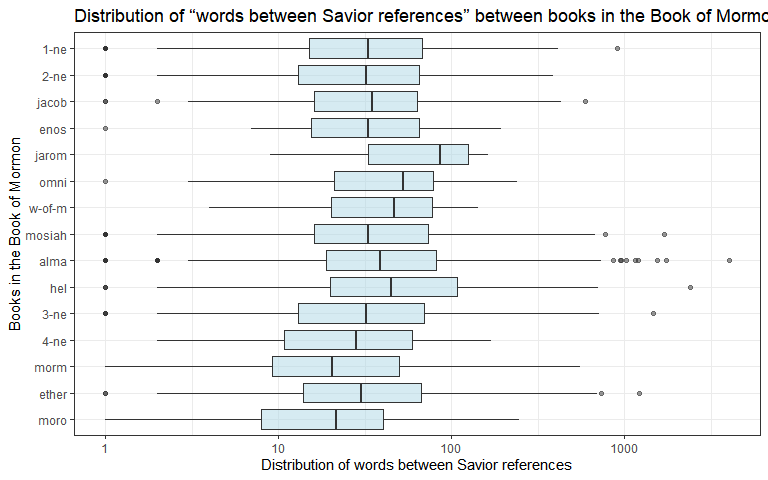

# Background

In 1978 Susan Easton Black penned an article in the Ensign titled Names of Christ in the Book of Mormon. This article claims “even statistically, he is the dominant figure of the Book of Mormon”. We are going to use our string skills to study word occurrences in the Book of Mormon and gather evidence to support the article.

# Loading in the data

Two datasets are loaded in for this project. The first is the entire body of scriptures in Mormon canon, the second is the various names of Jesus Christ.


```r
library(tidyverse)
library(stringi)

lds <- rio::import("http://scriptures.nephi.org/downloads/lds-scriptures.csv.zip")
rds <- rio::import("https://byuistats.github.io/M335/data/BoM_SaviorNames.rds")
```

# Creating functions

The following code under "break_jesus" writes a function that takes two inputs: a string, and a regular expression pattern. The function searches the string for pattern matches and then count the number of words between each match. The output is a tibble with a column for the phrase between matches and a column for the word count. 


```r
jesuspat <- rds |> 
  pull(name) |> 
  str_c(collapse = "|")

# This function pulls text from LDS. Parameter(book) specifies book e.g. "mosiah"
get_text <- function(book){
  text <- lds |> 
      filter(book_lds_url == book) |> 
      pull(scripture_text) |> 
      unlist() |> 
      str_c(collapse = " ")
  text
}

# This function breaks up dfs Paramter(phrase) specifies text, (pattern) specifies what it separates by
break_jesus <- function(phrase,pattern){
  
  # This function gets the # of words given the parameter, x.
  count_words <- function(x){stri_stats_latex(x)["Words"]}
  
  temp <- str_split(phrase, pattern) |> unlist()
  data.frame(temp)|>
    rowwise() |> 
    mutate(word_count = count_words(temp))
}

# This function, given a parameter (book) from LDS will "break_jesus"
gswc <- function(book){
break_jesus(get_text(book),jesuspat) |> 
    mutate(book = book)
}
```

# Bibbles (big biblical tibbles)

For each book in the Book of Mormon, the various functions made are used to count the number of words between each reference to the Savior.

```r
bom_books <- lds |> 
  filter(volume_lds_url == "bm") %>%
  .$book_lds_url |> unique()

bibble <- data.table::rbindlist(map(bom_books, gswc))|> 
  mutate(book = book |> fct_inorder())
```

# Distributions of filler

The following code creates a visualization that allows you to compare the distribution of “words between Savior references” between books in the Book of Mormon.


```r
bibble |> 
ggplot(aes(x = word_count, y = book |> fct_rev(), label = book)) +
  geom_boxplot(alpha = .5, fill = "lightblue") +
  scale_x_continuous(trans = 'log10') +
  theme_bw() +
  theme(legend.position = "none") +
  labs(title = "Distribution of “words between Savior references” between books in the Book of Mormon.",
    x = "Distribution of words between Savior references",
    y = "Books in the Book of Mormon")
```

<!-- -->

From the visualization above, we can tell that on average, it takes only 20-40 words to mention Jesus Christ after an occurance of Jesus Christ.
