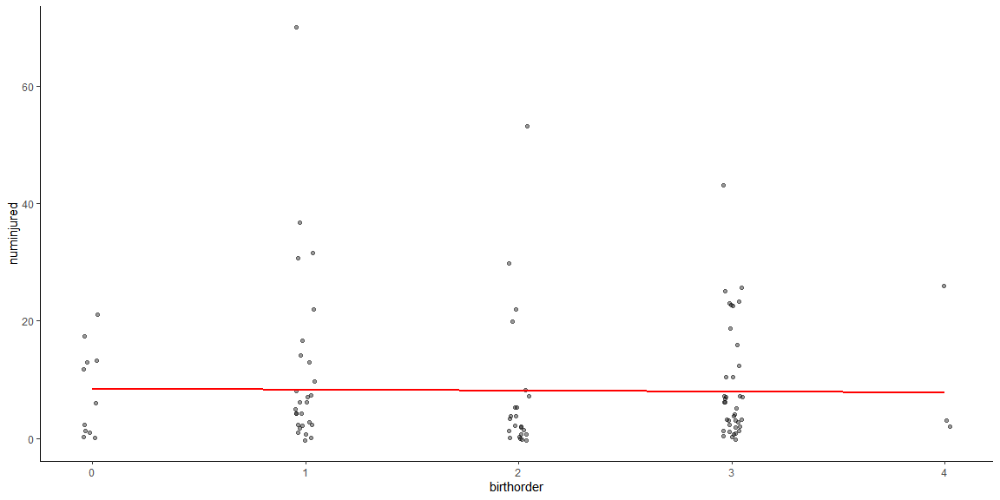
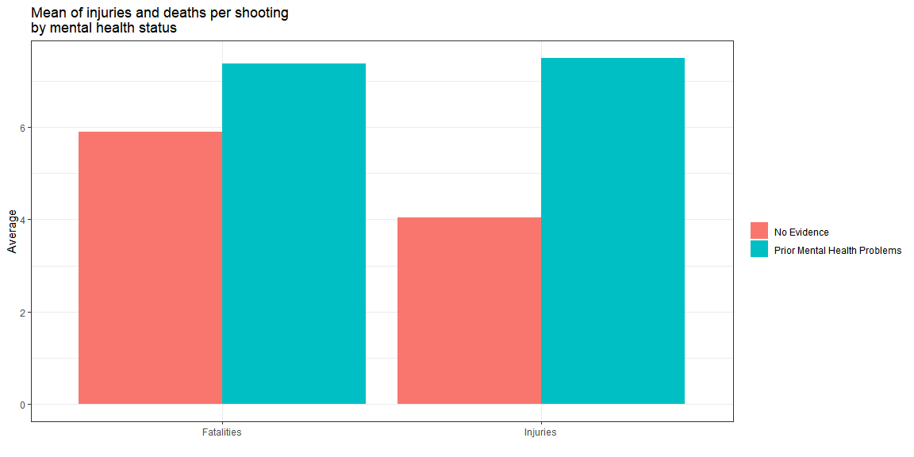

# The Violence Project

The Violence Project is a nonprofit, nonpartisan research center dedicated to reducing violence in society and using data and analysis to improve policy and practice.[see here.](https://www.theviolenceproject.org/about-us/) The center has one of the most comprehensive databases that track mass shootings. This analysis will measure and compare demographic associations like age, sex, and race with quantitative outcome variables including number of people killed and injured.

**Definition of Mass Shooting** According to the methodology of this database, "a 'mass public shooting' is defined to mean a multiple homicide incident in which four or more victims are murdered with firearms, within one event, in at least one or more public locations, such as, a workplace, school, restaurant, house of worship, neighborhood, or other public setting." This definition comes from the Congressional Research Service [See here.](https://sgp.fas.org/crs/misc/R44126.pdf)

This dataset records mass shootings between 1966 and February 2020.

## Loading in the data


```r
library(tidyverse)
library(readxl)
```


```r
ms.raw <- read_csv("https://raw.githubusercontent.com/ajaverett/data/main/msd.csv", 
  skip = 1)

ms <- ms.raw |>
  select('Shooter Last Name', 'Shooter First Name','Full Date',"Number Killed","Number Injured","Age","Race","Education","Birth Order", `Day of Week`, `Mental Illness`) |> 
  mutate(birthorder = `Birth Order`,
            numkilled = `Number Killed`,
         numinjured = `Number Injured`,
         wday = `Day of Week`,
         m.ill = `Mental Illness`) |> 
  filter(numinjured < 700)
```

Mass shootings, while not particularly common, have captured the public eye as a threat. While these devastating phenomenon are hard to study, this analysis seeks to shed some quantitative light on mass shootings in America.

# A typical mass shooting

Under the congressional definition of a mass shooting, a typical mass shooting will result in 5 deaths and 3 injuries. This is seen visually with the histogram below.


```r
ms.raw |> 
  pull(`Number Killed`) |> 
  median()
```

```
## [1] NA
```

```r
ms.raw |> 
  pull(`Number Injured`) |> 
  median()
```

```
## [1] NA
```

## Distribution of fatalities and injuries

We can additionally see the distribution of fatalities and injuries for mass shootings by using a histogram. Since mass shootings only count for four deaths or more, the histogram starts at four.


```r
ms |> 
  select(Race, numinjured, numkilled) |> 
  mutate(id = row_number()) |> 
  pivot_longer(cols = c(numinjured,numkilled)) |> 
  ggplot(aes(x = value, fill = name, binwidth = 3)) +
  geom_histogram(bins = 40) +
  coord_cartesian(xlim = c(0,20)) +
  theme_bw() +
  facet_wrap(name~.) + labs(
    x = "Number of injuries                    Number of fatalities",
    y = "Count",
    title = "Histogram of Injuries and Fatalities"
  ) + theme(legend.position="none") + 
  theme(
    strip.background = element_blank(),
    strip.text.x = element_blank()
  ) + scale_x_continuous(breaks = seq(0, 20, by = 2))
```

<!-- -->

## Analyzing the days of the week

We can see the distribution by day of mass shootings. It seems possible that there could be an association that more mass shootings could happen depending on the day of the week. The graph below visually charts total number of deaths and injuries from mass shootings grouped by each day of the week. While Wednesday yields the highest average for fatalities, this could understandably be due to chance. In order to test this, I will run two ANOVAs testing if fatalities and injuries respectively are are independent from the day of the week the mass shooting occurred.


```r
ms.wday <- ms |> 
  select(wday, numkilled, numinjured) |> 
  group_by(wday) |> 
  summarize(total.fat = mean(numkilled),
            total.inj = mean(numinjured)) |> 
  ungroup() |> 
  mutate(wday = factor(wday, levels = c("Sunday",
                                        "Monday",
                                        "Tuesday",
                                        "Wednesday",
                                        "Thursday",
                                        "Friday",
                                        "Saturday")))

ms.wday |>
  pivot_longer(cols = c(total.fat, total.inj)) |> 
  mutate(name=recode(name,
    total.fat = "Average fatalities",
    total.inj = "Average injuries")) |> 
ggplot(aes(x = wday, y = value,  fill = name)) +
  geom_bar(position = 'dodge', stat = "identity") +
  theme_bw() + labs(x = "Day of the Week",
                    y = "Count",
                    title = "Average amount of deaths and injuries from mass shootings \nhave occured on each day of the week") +
  theme(axis.text.x = element_text(angle = 45, vjust = 1, hjust = 1)) + 
  scale_fill_discrete(name = "") + 
  theme(legend.position = "bottom")
```

<!-- -->

### ANOVA One

**Comparison of fatalities and weekday:** This ANOVA will check the analysis of variance for each mean of fatalities for weekdays. The null hypothesis is that all the means come from an over-arching single distribution, while the alternative is that at least one weekday may help produce results that come from a different distribution.

**Hypothesis:**

$H_0: \mu_{Sunday} = \mu_{Monday} = \mu_{Tuesday} = \ldots = \mu_{m} = \mu$ $H_a: \mu_i \neq \mu \quad \text{for at least one}\ i\in\{1,\ldots,m\}.$

**Analysis:** Below is the ANOVA test for the mass shooting data.


```r
aov.raw <- ms |> 
  select(wday, numkilled, numinjured)
fatalities.aov <- aov(numkilled ~ wday, data = aov.raw)
summary(fatalities.aov) |> pander::pander()
```


-----------------------------------------------------------
    &nbsp;       Df    Sum Sq   Mean Sq   F value   Pr(>F) 
--------------- ----- -------- --------- --------- --------
   **wday**       6     123      20.49    0.6931    0.6555 

 **Residuals**   173    5115     29.57      NA        NA   
-----------------------------------------------------------

Table: Analysis of Variance Model

**Assumptions:** From the graph below, we can see that there is relatively acceptable constant variance, however the data seems to be heavily right skewed.


```r
par(mfrow = c(1,2))
plot(fatalities.aov, which=1)
car::qqPlot(fatalities.aov$residuals, id=FALSE)
```

<!-- -->

**Interpretation** This test gives a very high P-value indicating that the odds that the data is coming from different distributions, assuming the null hypothesis is true, is very low.

<br>

### ANOVA Two

**Comparison of injuries and weekday:** This ANOVA will check the analysis of variance for each mean of injuries for weekdays. The null hypothesis is that all the means come from an over-arching single distribution, while the alternative is that at least one weekday may help produce results that come from a different distribution.

**Hypothesis:**

$H_0: \mu_{Sunday} = \mu_{Monday} = \mu_{Tuesday} = \ldots = \mu_{m} = \mu$ $H_a: \mu_i \neq \mu \quad \text{for at least one}\ i\in\{1,\ldots,m\}.$

**Analysis:** Below is the ANOVA test for the mass shooting data.


```r
injuries.aov <- aov(numinjured ~ wday, data = aov.raw)
summary(injuries.aov) |> pander::pander()
```


-----------------------------------------------------------
    &nbsp;       Df    Sum Sq   Mean Sq   F value   Pr(>F) 
--------------- ----- -------- --------- --------- --------
   **wday**       6    91.67     15.28    0.1487    0.9891 

 **Residuals**   173   17781     102.8      NA        NA   
-----------------------------------------------------------

Table: Analysis of Variance Model

**Assumptions:** From the graph below, we can see that there is relatively acceptable constant variance, however the data seems to be heavily right skewed.


```r
par(mfrow=c(1,2))
plot(injuries.aov, which=1)
car::qqPlot(injuries.aov$residuals, id=FALSE)
```

<!-- -->

**Interpretation** This test gives a very high P-value indicating that the odds that the data is coming from different distributions, assuming the null hypothesis is true, is very low.

# Associations between demographics and outcomes

## Birth Order

Birth order is an interesting sociological variable since it has been repeatedly linked with psychological variables including intelligence, personality, and psychopathology. [See here.](https://www.pnas.org/doi/10.1073/pnas.1519064112) The birth order measurement is conducted as such: if you are an only child, you are assigned a 0, if you are the first born with siblings, you are an assigned a 1, if you are a middle child, you are assigned a 2, and if you are the youngest child, you are assigned a 3. In order to see if there was an association between this birth order variable, (as and increase in a number in the birth order scale, you are figuratively lower on the totem pole) we will use a linear regression to see if the slope is zero or not.

### Linear regression between birth order and fatalities

The model for this linear regression is as follows: $\underbrace{Y_i}_\text{Fatalities} = \beta_0 + \beta_1 \underbrace{X_i}_\text{Birth Order}$

**Hypothesis:** $H_0: \beta_1 = 0, H_a: \beta_1 \neq 0$ This indicates that the null hypothesis states that an increase or decrease in birth order does not effect the number of fatalities in a mass shooting

**Analysis:** Below is the linear regression analysis.


```r
ms.a <- lm(numkilled ~ birthorder, data = ms |> filter(birthorder %in% 0:3)) 
ms.a |> summary() |> pander::pander()
```


---------------------------------------------------------------
     &nbsp;        Estimate   Std. Error   t value   Pr(>|t|)  
----------------- ---------- ------------ --------- -----------
 **(Intercept)**    8.423        1.39       6.06     2.596e-08 

 **birthorder**    -0.1649      0.6441     -0.2561    0.7984   
---------------------------------------------------------------


-----------------------------------------------------------------
 Observations   Residual Std. Error     $R^2$     Adjusted $R^2$ 
-------------- --------------------- ----------- ----------------
      99               6.687          0.0006757     -0.009627    
-----------------------------------------------------------------

Table: Fitting linear model: numkilled ~ birthorder

**Assumptions** From the graph below, we can see that there is relatively acceptable constant variance, however the data seems to be heavily right skewed.


```r
par(mfrow=c(1,2))
plot(ms.a, which=1)
car::qqPlot(ms.a$residuals, id=FALSE)
```

<!-- -->

**Visualization** The chart below graphs birth order and number of fatalities with the linear regression overlayed.


```r
b.a <- coef(ms.a)
ms |> 
  ggplot(aes(x = birthorder, y = numkilled)) +
  geom_jitter(width = 0.05, alpha = .4) +
  stat_function(fun = function(x) b.a[2]*x + b.a[1],
                color = "red",
                size = 1) +
  theme_classic()
```

<!-- -->

**Interpretation** From the results of the analysis, there seems to be not much evidence that birth order is associated with number of fatalities. The p-value indicates that there is not sufficient evidence to reject the null hypothesis.

<br> <br>

### Linear regression between birth order and injuries

The model for this linear regression is as follows: $\underbrace{Y_i}_\text{Injuries} = \beta_0 + \beta_1 \underbrace{X_i}_\text{Birth Order}$

**Hypothesis:** $H_0: \beta_1 = 0, H_a: \beta_1 \neq 0$ This indicates that the null hypothesis states that an increase or decrease in birth order does not effect the number of injuries in a mass shooting.

**Analysis:** Below is the linear regression analysis.


```r
ms.b <- lm(numkilled ~ birthorder, data = ms |> filter(birthorder %in% 0:3)) 
ms.b |> summary() |> pander::pander()
```


---------------------------------------------------------------
     &nbsp;        Estimate   Std. Error   t value   Pr(>|t|)  
----------------- ---------- ------------ --------- -----------
 **(Intercept)**    8.423        1.39       6.06     2.596e-08 

 **birthorder**    -0.1649      0.6441     -0.2561    0.7984   
---------------------------------------------------------------


-----------------------------------------------------------------
 Observations   Residual Std. Error     $R^2$     Adjusted $R^2$ 
-------------- --------------------- ----------- ----------------
      99               6.687          0.0006757     -0.009627    
-----------------------------------------------------------------

Table: Fitting linear model: numkilled ~ birthorder

**Assumptions** From the graph below, we can see that there is relatively acceptable constant variance, however the data seems to be heavily right skewed.


```r
par(mfrow=c(1,2))
plot(ms.a, which=1)
car::qqPlot(ms.a$residuals, id=FALSE)
```

<!-- -->

**Visualization** The chart below graphs birth order and number of injuries with the linear regression overlayed.


```r
b.b <- coef(ms.b)
ms |> 
  ggplot(aes(x = birthorder, y = numinjured)) +
  geom_jitter(width = 0.05, alpha = .4) +
  stat_function(fun = function(x) b.b[2]*x + b.b[1],
                color = "red",
                size = 1) +
  theme_classic()
```

<!-- -->

**Interpretation** From the results of the analysis, there seems to be not much evidence that birth order is associated with number of injuries The p-value indicates that there is not sufficient evidence to reject the null hypothesis.

<br> <br>

## Age

Age is another interesting sociological variable as it is possible that the older someone gets, the more or less efficient they are in producing fatalities or injuries. The code and analysis below will be testing this with a linear regression as well.

### Linear regression between age and fatalities

The model for this linear regression is as follows: $\underbrace{Y_i}_\text{Fatalities} = \beta_0 + \beta_1 \underbrace{X_i}_\text{Age}$

**Hypothesis:** $H_0: \beta_1 = 0, H_a: \beta_1 \neq 0$ This indicates that the null hypothesis states that an increase or decrease in age does not effect the number of fatalities in a mass shooting.

**Analysis:** Below is the linear regression analysis.


```r
ms.c <- lm(numkilled ~ Age, data = ms) 
ms.c |> summary() |> pander::pander()
```


---------------------------------------------------------------
     &nbsp;        Estimate   Std. Error   t value   Pr(>|t|)  
----------------- ---------- ------------ --------- -----------
 **(Intercept)**    8.664       1.187       7.298    9.504e-12 

     **Age**       -0.05159    0.03317     -1.555     0.1217   
---------------------------------------------------------------


---------------------------------------------------------------
 Observations   Residual Std. Error    $R^2$    Adjusted $R^2$ 
-------------- --------------------- --------- ----------------
     179               5.401          0.01348      0.007906    
---------------------------------------------------------------

Table: Fitting linear model: numkilled ~ Age

**Assumptions** From the graph below, we can see that there is relatively acceptable constant variance, however the data seems to be heavily right skewed.


```r
par(mfrow=c(1,2))
plot(ms.a, which=1)
car::qqPlot(ms.a$residuals, id=FALSE)
```

<!-- -->

**Visualization** The chart below graphs age and number of fatalities with the linear regression overlayed.


```r
b.c <- coef(ms.c)
ms |> 
  ggplot(aes(x = Age, y = numkilled)) +
  geom_jitter(width = 0.05, alpha = .4) +
  stat_function(fun = function(x) b.c[2]*x + b.c[1],
                color = "red",
                size = 1) +
  theme_classic()
```

<!-- -->

**Interpretation** From the results of the analysis, there seems to be little evidence that age is associated with number of fatalities. The p-value indicates that there is not sufficient evidence to reject the null hypothesis.

This means that, according to this linear regression, for each 19.3 year decrease of age of the mass shooter, an additional fatality is recorded

<br> <br>

### Linear regression between age and injuries

The model for this linear regression is as follows: $\underbrace{Y_i}_\text{Injuries} = \beta_0 + \beta_1 \underbrace{X_i}_\text{Age}$

**Hypothesis:** $H_0: \beta_1 = 0, H_a: \beta_1 \neq 0$ This indicates that the null hypothesis states that an increase or decrease in age does not effect the number of injuries in a mass shooting.

**Analysis:** Below is the linear regression analysis.


```r
##
ms.d <- lm(numinjured ~ Age, data = ms) 
ms.d |> summary() |> pander::pander()
```


---------------------------------------------------------------
     &nbsp;        Estimate   Std. Error   t value   Pr(>|t|)  
----------------- ---------- ------------ --------- -----------
 **(Intercept)**    12.67       2.151       5.891    1.893e-08 

     **Age**       -0.1847     0.06012     -3.072    0.002461  
---------------------------------------------------------------


---------------------------------------------------------------
 Observations   Residual Std. Error    $R^2$    Adjusted $R^2$ 
-------------- --------------------- --------- ----------------
     179               9.788          0.05063      0.04526     
---------------------------------------------------------------

Table: Fitting linear model: numinjured ~ Age

**Visualization** The chart below graphs age and number of injuries with the linear regression overlayed.


```r
b.d <- coef(ms.d)
ms |> 
  ggplot(aes(x = Age, y = numinjured)) +
  geom_jitter(width = 0.05, alpha = .4) +
  stat_function(fun = function(x) b.d[2]*x + b.d[1],
                color = "red",
                size = 1) +
  theme_classic()
```

<!-- -->

**Interpretation** From the results of the analysis, there seems to be evidence that age is associated with number of fatalities. The p-value indicates that there is sufficient evidence to reject the null hypothesis.

This means that, according to this linear regression, for each 5.4 year decrease of age of the mass shooter, an additional person gets injured

<br> <br>

## Education

The educational variable measures the attainment of education of the perpetrator. If the last completed education was less than high school, they are assigned a zero, if they completed high school or a GED, they are assigned a 1, if they completed some college or completed a trade, they are assigned a 2, if they have obtained a Bachelor's degree, they are assigned a 3, and finally, if they have a graduate degree, they are assigned a 4. This measurement may be sufficient as there are roughly two year intervals in years of education for each assigned number.

### Linear regression between education and fatalities

The model for this linear regression is as follows: $\underbrace{Y_i}_\text{Fatalities} = \beta_0 + \beta_1 \underbrace{X_i}_\text{Education Level}$

**Hypothesis:** $H_0: \beta_1 = 0, H_a: \beta_1 \neq 0$ This indicates that the null hypothesis states that an increase or decrease in education level does not effect the number of fatalities in a mass shooting.

**Analysis:** Below is the linear regression analysis.


```r
ms.e <- lm(numkilled ~ Education, data = ms) 
ms.e |> summary() |> pander::pander()
```


---------------------------------------------------------------
     &nbsp;        Estimate   Std. Error   t value   Pr(>|t|)  
----------------- ---------- ------------ --------- -----------
 **(Intercept)**    6.824       0.9428      7.238    3.739e-11 

  **Education**     0.4948      0.4751      1.042     0.2996   
---------------------------------------------------------------


----------------------------------------------------------------
 Observations   Residual Std. Error    $R^2$     Adjusted $R^2$ 
-------------- --------------------- ---------- ----------------
     130               6.126          0.008404     0.0006573    
----------------------------------------------------------------

Table: Fitting linear model: numkilled ~ Education

**Visualization** The chart below graphs educational attainment and number of fatalities with the linear regression overlayed.


```r
b.e <- coef(ms.e)
ms |> 
  ggplot(aes(x = Education, y = numkilled)) +
  geom_jitter(width = 0.05, alpha = .4) +
  stat_function(fun = function(x) b.e[2]*x + b.e[1],
                color = "red",
                size = 1) +
  theme_classic()
```

<!-- -->

**Interpretation** From the results of the analysis, there seems to be virtually no evidence that educational attainment is associated with number of fatalities. The p-value indicates that there is not sufficient evidence to reject the null hypothesis.

According to this linear regression, for each 2 unit increase in educational status (Some HS, HS/GED, Some College, Bachelors, Graduate) of the mass shooter, an additional person gets injured

<br> <br>

### Linear regression between education and injuries

The model for this linear regression is as follows: $\underbrace{Y_i}_\text{Injuries} = \beta_0 + \beta_1 \underbrace{X_i}_\text{Education Level}$

**Hypothesis:** $H_0: \beta_1 = 0, H_a: \beta_1 \neq 0$ This indicates that the null hypothesis states that an increase or decrease in education level does not effect the number of injuries in a mass shooting.

**Analysis:** Below is the linear regression analysis.


```r
##
ms.f <- lm(numinjured ~ Education, data = ms) 
ms.f |> summary() |> pander::pander()
```


--------------------------------------------------------------
     &nbsp;        Estimate   Std. Error   t value   Pr(>|t|) 
----------------- ---------- ------------ --------- ----------
 **(Intercept)**    4.881       1.698       2.874    0.004747 

  **Education**     1.912       0.8558      2.235    0.02717  
--------------------------------------------------------------


---------------------------------------------------------------
 Observations   Residual Std. Error    $R^2$    Adjusted $R^2$ 
-------------- --------------------- --------- ----------------
     130               11.04          0.03755      0.03003     
---------------------------------------------------------------

Table: Fitting linear model: numinjured ~ Education

**Visualization** The chart below graphs educational attainment and number of injuries with the linear regression overlayed.


```r
b.f <- coef(ms.f)
ms |> 
  ggplot(aes(x = Education, y = numinjured)) +
  geom_jitter(width = 0.05, alpha = .4) +
  stat_function(fun = function(x) b.f[2]*x + b.f[1],
                color = "red",
                size = 1) +
  theme_classic()
```

<!-- -->

**Interpretation** From the results of the analysis, there seems to be evidence that educational attainment is associated with number of injuries. The p-value indicates that there is sufficient evidence to reject the null hypothesis.

According to this linear regression, for each unit increase in educational status (Some HS, HS/GED, Some College, Bachelors, Graduate) of the mass shooter, 2 additional people get injured.

## Conclusion

It seems that, according to the analyses above, the only significant test results (assuming $\alpha = 0.05$) include the effect of age and education on injuries. If these findings are accurate, it would mean that in mass shootings, more educated people are more likely to injure others and that older people are less likely to injure others.

# T-tests on Race and Mental Health

## Race

It is possible that the race of the perpetrator, Black or White, may be associated with the number of injuries and deaths of each mass shooting. Below is the racial breakdown of mass shooters.


```r
ms |> 
  filter(Race %in% 0:5) |> 
  select(Race, numkilled, numinjured) |> 
  mutate(Race = recode(Race, 
                    `0` = "White",
                    `1` = "Black",
                    `2` = "Hispanic",
                    `3` = "Asian",
                    `4` = "Mideastern",
                    `5` = "American Indian")) |> 
  mutate(`Race of Offender` = "Race") |> 
  ggplot(aes(y = `Race of Offender`, fill = Race)) +
  geom_bar(position="fill") +
  labs(x = "Percent of Mass Shooters",
       title = "Proportion of Race among mass shooters") +
  scale_x_continuous(labels = scales::percent) +
  theme_bw()
```

<!-- -->

```r
ms |> 
  filter(Race %in% 0:5) |> 
  group_by(Race) |> 
  count() |> 
  mutate(Race = recode(Race, 
                    `0` = "White",
                    `1` = "Black",
                    `2` = "Hispanic",
                    `3` = "Asian",
                    `4` = "Mideastern",
                    `5` = "American Indian")) |>
  ungroup() |> 
  mutate(percent = (n/sum(n)*100) |> round(1)) |> 
  select(-n) |> pander::pander()
```


---------------------------
      Race         percent 
----------------- ---------
      White         56.2   

      Black         21.9   

    Hispanic         8.9   

      Asian          6.5   

   Mideastern        4.7   

 American Indian     1.8   
---------------------------

**Visualization**


```r
ms |> 
  filter(Race %in% 0:1) |> 
  select(Race, numkilled, numinjured) |> 
  group_by(Race) |> 
  summarize(mean.killed = mean(numkilled),
            mean.injured = mean(numinjured)) |> 
  mutate(Race=recode(Race, 
                         `0`="White",
                         `1`="Black")) |>
  pivot_longer(cols = c(mean.killed, mean.injured)) |> 
  mutate(name=recode(name, 
                     mean.injured="Injuries",
                     mean.killed="Fatalities")) |>
  ggplot(aes(x = name, y = value, fill = Race)) +
    geom_bar(position = "dodge", stat = "identity") +
  labs(title = "Mean of injuries and deaths per shooting \nonly including White and Black people",
       y = "Average", 
       x = "") + theme_bw()
```

<!-- -->

### T-test of race and fatality amount

**Hypothesis**

The null hypothesis states that the average amount of fatalities are the same for both Black and White people. The alternative hypothesis states there is a difference between the average amount of fatalities depending on the race of the shooter. $H_0: \mu_{Black} - \mu_{White}= 0, H_a: \mu_{Black} - \mu_{White} \neq 0$

**Analysis**

The analysis below conducts a t-test between Black and White people measuring the difference of fatalities in shootings.


```r
t.ms <- ms |> 
  filter(Race %in% 0:1) |> 
  select(Race, numkilled, numinjured)
t.test(numkilled ~ Race, data = t.ms) |> pander::pander()
```


----------------------------------------------------------------
 Test statistic    df       P value      Alternative hypothesis 
---------------- ------- -------------- ------------------------
     3.251        125.7   0.001478 * *         two.sided        
----------------------------------------------------------------

Table: Welch Two Sample t-test: `numkilled` by `Race` (continued below)

 
-----------------------------------
 mean in group 0   mean in group 1 
----------------- -----------------
      7.347             5.351      
-----------------------------------

**Assumptions**

The data seems to be very right-skewed.


```r
par(mfrow = c(1,2))
car::qqPlot(t.ms |> filter(Race == 0) |> pull(numkilled), main = "QQ-Plot of \nFatalities by Black people.", pch = 19)
```

```
## [1] 72 78
```

```r
car::qqPlot(t.ms |> filter(Race == 1) |> pull(numkilled), main = "QQ-Plot of \nFatalities by White people", pch = 19)
```

<!-- -->

```
## [1] 28 34
```

**Interpretation**

From the data, there seems to be sufficient evidence to reject the null hypothesis, that fatalities between White and Black shooters come from the same distribution. This means in recorded mass shootings, White people have significantly higher produced fatalities than Black people.

### T-test of race and injury amount

**Hypothesis**

The null hypothesis states that the average amount of injuries are the same for both Black and White people. The alternative hypothesis states there is a difference between the average amount of injuries depending on the race of the shooter.

$H_0: \mu_{Black} - \mu_{White}= 0, H_a: \mu_{Black} - \mu_{White} \neq 0$

**Analysis**

The analysis below conducts a t-test between Black and White people measuring the difference of fatalities in shootings.


```r
t.test(numinjured ~ Race, data = t.ms) |> pander::pander()
```


----------------------------------------------------------------
 Test statistic    df       P value      Alternative hypothesis 
---------------- ------- -------------- ------------------------
      3.27        129.8   0.001377 * *         two.sided        
----------------------------------------------------------------

Table: Welch Two Sample t-test: `numinjured` by `Race` (continued below)

 
-----------------------------------
 mean in group 0   mean in group 1 
----------------- -----------------
      7.832             3.595      
-----------------------------------

**Assumptions**

The data seems to be very right-skewed.


```r
par(mfrow = c(1,2))
car::qqPlot(t.ms |> filter(Race == 0) |> pull(numinjured), main = "QQ-Plot of \nInjuries by Black people.", pch = 19)
```

```
## [1] 69 88
```

```r
car::qqPlot(t.ms |> filter(Race == 1) |> pull(numinjured), main = "QQ-Plot of \nInjuries by White people", pch = 19)
```

<!-- -->

```
## [1] 9 1
```

**Interpretation**

From the data, there seems to be sufficient evidence to reject the null hypothesis, that injuries between White and Black shooters come from the same distribution. This means in recorded mass shootings, White people have significantly higher produced injuries than Black people.

## Mental Health

It is possible that prior signs of mental health of the perpetrator may be associated with the number of injuries and deaths of each mass shooting. Below is the breakdown of mass shooters depending on prior signs of mental health.


```r
ms |> 
  select(m.ill, numkilled, numinjured) |> 
  mutate(
    m.ill = case_when(
      m.ill == 0 ~ "No Evidence",
      TRUE ~ "Prior Mental Health Problems"
    )
  ) |> 
  mutate(`Mental Health Status` = "") |> 
  ggplot(aes(y = `Mental Health Status`, fill = m.ill)) +
  geom_bar(position = "fill") +
  labs(x = "Percent of Mass Shooters",
       title = "Prior mental health status among mass shooters") +
  scale_x_continuous(labels = scales::percent) +
  theme_bw() + scale_fill_discrete(name = "") 
```

<!-- -->

**Visualization**


```r
ms |> 
  select(m.ill, numkilled, numinjured) |> 
  mutate(
    m.ill = case_when(
      m.ill == 0 ~ "No Evidence",
      TRUE ~ "Prior Mental Health Problems"
    )
  ) |> 
  group_by(m.ill) |> 
  summarize(mean.killed = mean(numkilled),
            mean.injured = mean(numinjured)) |> 
  pivot_longer(cols = c(mean.killed, mean.injured)) |> 
  mutate(name=recode(name, 
                     mean.injured="Injuries",
                     mean.killed="Fatalities")) |>
  ggplot(aes(x = name, y = value, fill = m.ill)) +
    geom_bar(position = "dodge", stat = "identity") +
  labs(title = "Mean of injuries and deaths per shooting \nby mental health status",
       y = "Average", 
       x = "") +
  theme_bw() + scale_fill_discrete(name = "") 
```

<!-- -->

### T-test of mental health and fatality amount

**Hypothesis**

The null hypothesis states that the average amount of fatalities are the same for people regardless of recorded mental health history. The alternative hypothesis states there is a difference between the average amount of fatalities depending on the prior recorded mental health status of the shooter. $H_0: \mu_{No History} - \mu_{History}= 0, H_a: \mu_{No History} - \mu_{History} \neq 0$

**Analysis**

The analysis below conducts a t-test between perpetrators with mental health history and no mental health history and the difference of fatalities in shootings.


```r
mh.ms <- ms |> 
  select(m.ill, numkilled, numinjured) |> 
  mutate(m.ill = case_when(
      m.ill == 0 ~ 0,
      TRUE ~ 1
    ))
t.test(numkilled ~ m.ill, data = mh.ms) |> pander::pander()
```


-------------------------------------------------------------------------------
 Test statistic    df      P value    Alternative hypothesis   mean in group 0 
---------------- ------- ----------- ------------------------ -----------------
     -2.099       169.5   0.03728 *         two.sided               5.891      
-------------------------------------------------------------------------------

Table: Welch Two Sample t-test: `numkilled` by `m.ill` (continued below)

 
-----------------
 mean in group 1 
-----------------
      7.368      
-----------------

**Assumptions**

The data seems to be very right-skewed.


```r
par(mfrow = c(1,2))
car::qqPlot(mh.ms |> filter(m.ill == 0) |> pull(numkilled), main = "QQ-Plot of Fatalities by perpetrators \nwith no mental heath history.", pch = 19)
```

```
## [1] 52 43
```

```r
car::qqPlot(mh.ms |> filter(m.ill == 1) |> pull(numkilled), main = "QQ-Plot of Fatalities by perpetrators \nwith no mental heath history", pch = 19)
```

<!-- -->

```
## [1] 102  72
```

**Interpretation**

From the data, there seems to be sufficient evidence to reject the null hypothesis, that fatalities between those with recorded mental health history and those without come from the same distribution. This means in recorded mass shootings, Those with mental health histories people have significantly higher produced fatalities than those without.

### T-test of mental health and injury amount

**Hypothesis**

The null hypothesis states that the average amount of injuries are the same for people regardless of recorded mental health history. The alternative hypothesis states there is a difference between the average amount of injuries depending on the prior recorded mental health status of the shooter. $H_0: \mu_{No History} - \mu_{History}= 0, H_a: \mu_{No History} - \mu_{History} \neq 0$

**Analysis**

The analysis below conducts a t-test between perpetrators with mental health history and no mental health history and the difference of injuries in shootings.


```r
mh.ms <- ms |> 
  select(m.ill, numkilled, numinjured) |> 
  mutate(m.ill = case_when(
      m.ill == 0 ~ 0,
      TRUE ~ 1
    ))
t.test(numinjured ~ m.ill, data = mh.ms) |> pander::pander()
```


---------------------------------------------------------------
 Test statistic    df       P value     Alternative hypothesis 
---------------- ------- ------------- ------------------------
     -2.756       175.8   0.00647 * *         two.sided        
---------------------------------------------------------------

Table: Welch Two Sample t-test: `numinjured` by `m.ill` (continued below)

 
-----------------------------------
 mean in group 0   mean in group 1 
----------------- -----------------
      4.036             7.496      
-----------------------------------

**Assumptions**

The data seems to be very right-skewed.


```r
par(mfrow = c(1,2))
car::qqPlot(mh.ms |> filter(m.ill == 0) |> pull(numinjured), main = "QQ-Plot of Injuries by perpetrators \nwith no mental heath history.", pch = 19)
```

```
## [1] 52 43
```

```r
car::qqPlot(mh.ms |> filter(m.ill == 1) |> pull(numinjured), main = "QQ-Plot of Injuries by perpetrators \nwith no mental heath history", pch = 19)
```

<!-- -->

```
## [1]  89 102
```

**Interpretation**

From the data, there seems to be sufficient evidence to reject the null hypothesis, that injuries between those with recorded mental health history and those without come from the same distribution. This means in recorded mass shootings, Those with mental health histories people have significantly higher produced injuries than those without.

## Conclusion

From the analyses above, it seems that there are significant differences between race, mental health, and outcomes in shootings. If the analyses above are correct, this means that White mass shooters tend to produce more fatalities and injuries than Black mass shooters and that those with prior problematic mental health histories tend to produce more fatalities and injuries as well.


# Extra part to get credit for CS9

```r
ms.race1 <- ms |> 
  filter(Race %in% 0:5) |> 
  mutate(Race = recode(Race, 
                    `0` = "White",
                    `1` = "Black",
                    `2` = "Other",
                    `3` = "Other",
                    `4` = "Other",
                    `5` = "Other")) 

# library(lubridate)

ms.race1 |> 
  mutate(year = lubridate::year(lubridate::mdy(`Full Date`))) |> 
  pull(year) |> 
  mean()
```

```
## [1] 2001.74
```


```r
ms.race1 <- ms |> 
  filter(Race %in% 0:5) |> 
  mutate(Race = recode(Race, 
                    `0` = "White",
                    `1` = "Black",
                    `2` = "Other",
                    `3` = "Other",
                    `4` = "Other",
                    `5` = "Other")) |>
  group_by(Race) |> 
  count() |> 
  ungroup() |> 
  mutate(percent = (n/sum(n)*100) |> round(1)) |> 
  select(-n) 
```


```r
races <- read_csv("https://raw.githubusercontent.com/ajaverett/data/main/racs-gss.csv") |> 
  na.omit() |> 
  select('Label','2000','2002') |> 
  rename(y2000 = "2000",
         y2002 = "2002") |> 
  rowwise() |> 
  mutate('y2001' = mean(y2000,y2002)) |> 
  select(Label, y2001) |> 
  ungroup() |> 
  mutate(percentage = 100*(round(y2001 / sum(y2001),4))) |> 
  select(-y2001) |> 
  rename(Race = Label)
```


```r
ms.race1 |> 
  left_join(races) |> 
  rename(`Shooting percent` = percent,
         `Population percent` = percentage) |> 
  pivot_longer(cols = c(`Population percent`, `Shooting percent`)) |> 
  ggplot(aes(x = Race, y = value, fill = name)) + 
    geom_bar(position="dodge", stat="identity") + theme_test() +
  labs(x = "Race",
       y = "Percent of Population")
```

<!-- -->

