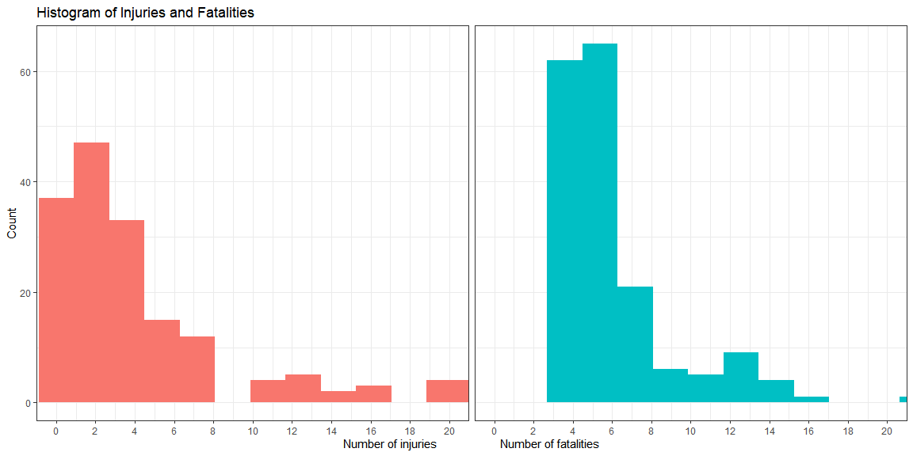
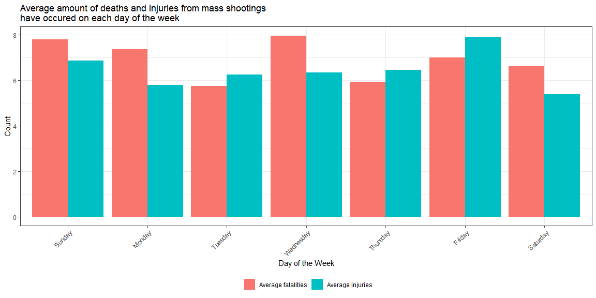
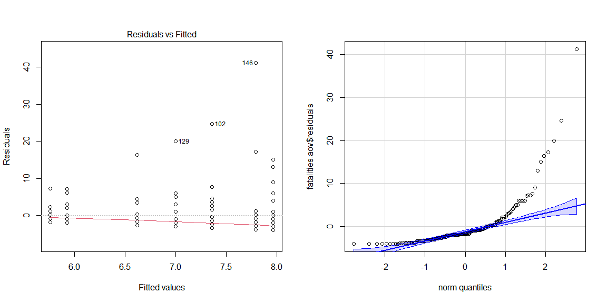
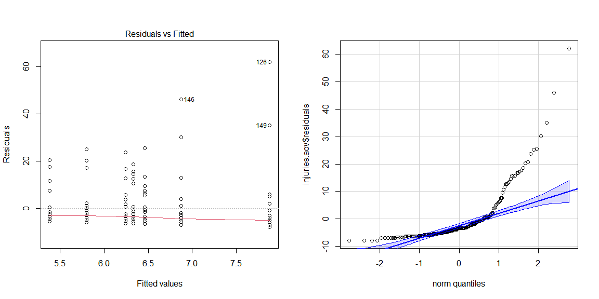
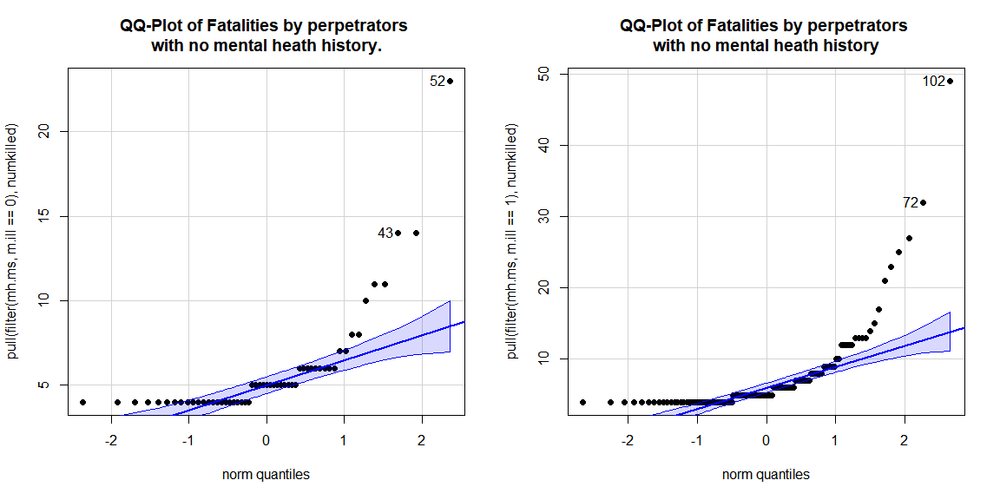
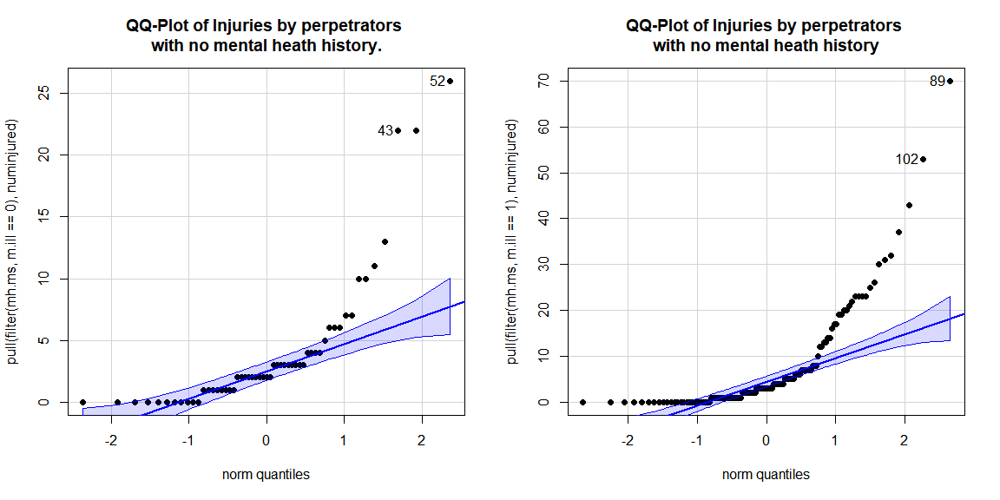
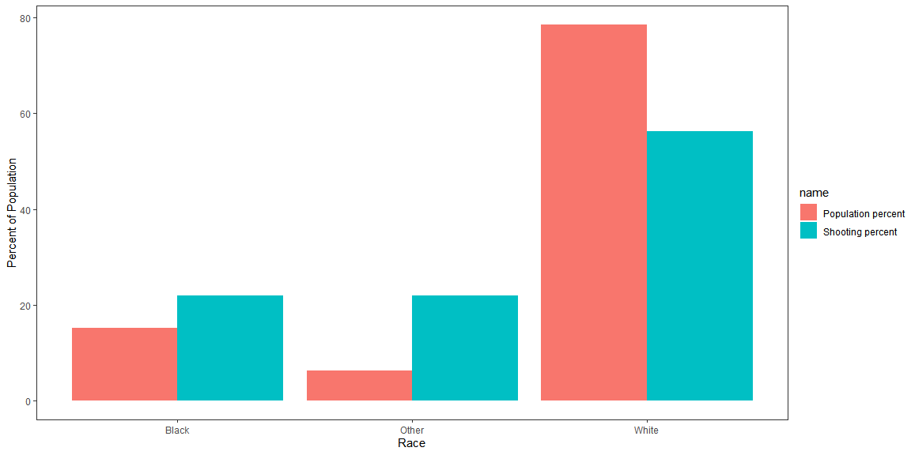

# The Violence Project

The Violence Project is a nonprofit, nonpartisan research center dedicated to reducing violence in society and using data and analysis to improve policy and practice.[see here.](https://www.theviolenceproject.org/about-us/) The center has one of the most comprehensive databases that track mass shootings. This analysis will measure and compare demographic associations like age, sex, and race with quantitative outcome variables including number of people killed and injured.

**Definition of Mass Shooting** According to the methodology of this database, "a 'mass public shooting' is defined to mean a multiple homicide incident in which four or more victims are murdered with firearms, within one event, in at least one or more public locations, such as, a workplace, school, restaurant, house of worship, neighborhood, or other public setting." This definition comes from the Congressional Research Service [See here.](https://sgp.fas.org/crs/misc/R44126.pdf)

This dataset records mass shootings between 1966 and February 2020.

## Loading in the data


```r
library(tidyverse)
library(readxl)
```


```r
ms.raw <- read_csv("https://raw.githubusercontent.com/ajaverett/data/main/msd.csv", 
  skip = 1)

ms <- ms.raw |>
  select('Shooter Last Name', 'Shooter First Name','Full Date',"Number Killed","Number Injured","Age","Race","Education","Birth Order", `Day of Week`, `Mental Illness`) |> 
  mutate(birthorder = `Birth Order`,
            numkilled = `Number Killed`,
         numinjured = `Number Injured`,
         wday = `Day of Week`,
         m.ill = `Mental Illness`) |> 
  filter(numinjured < 700)
```

Mass shootings, while not particularly common, have captured the public eye as a threat. While these devastating phenomenon are hard to study, this analysis seeks to shed some quantitative light on mass shootings in America.

# A typical mass shooting

Under the congressional definition of a mass shooting, a typical mass shooting will result in 5 deaths and 3 injuries. This is seen visually with the histogram below.


```r
ms.raw |> 
  pull(`Number Killed`) |> 
  median()
```

```
## [1] NA
```

```r
ms.raw |> 
  pull(`Number Injured`) |> 
  median()
```

```
## [1] NA
```

## Distribution of fatalities and injuries

We can additionally see the distribution of fatalities and injuries for mass shootings by using a histogram. Since mass shootings only count for four deaths or more, the histogram starts at four.


```r
ms |> 
  select(Race, numinjured, numkilled) |> 
  mutate(id = row_number()) |> 
  pivot_longer(cols = c(numinjured,numkilled)) |> 
  ggplot(aes(x = value, fill = name, binwidth = 3)) +
  geom_histogram(bins = 40) +
  coord_cartesian(xlim = c(0,20)) +
  theme_bw() +
  facet_wrap(name~.) + labs(
    x = "Number of injuries                    Number of fatalities",
    y = "Count",
    title = "Histogram of Injuries and Fatalities"
  ) + theme(legend.position="none") + 
  theme(
    strip.background = element_blank(),
    strip.text.x = element_blank()
  ) + scale_x_continuous(breaks = seq(0, 20, by = 2))
```

<!-- -->

## Analyzing the days of the week

We can see the distribution by day of mass shootings. It seems possible that there could be an association that more mass shootings could happen depending on the day of the week. The graph below visually charts total number of deaths and injuries from mass shootings grouped by each day of the week. While Wednesday yields the highest average for fatalities, this could understandably be due to chance. In order to test this, I will run two ANOVAs testing if fatalities and injuries respectively are are independent from the day of the week the mass shooting occurred.


```r
ms.wday <- ms |> 
  select(wday, numkilled, numinjured) |> 
  group_by(wday) |> 
  summarize(total.fat = mean(numkilled),
            total.inj = mean(numinjured)) |> 
  ungroup() |> 
  mutate(wday = factor(wday, levels = c("Sunday",
                                        "Monday",
                                        "Tuesday",
                                        "Wednesday",
                                        "Thursday",
                                        "Friday",
                                        "Saturday")))

ms.wday |>
  pivot_longer(cols = c(total.fat, total.inj)) |> 
  mutate(name=recode(name,
    total.fat = "Average fatalities",
    total.inj = "Average injuries")) |> 
ggplot(aes(x = wday, y = value,  fill = name)) +
  geom_bar(position = 'dodge', stat = "identity") +
  theme_bw() + labs(x = "Day of the Week",
                    y = "Count",
                    title = "Average amount of deaths and injuries from mass shootings \nhave occured on each day of the week") +
  theme(axis.text.x = element_text(angle = 45, vjust = 1, hjust = 1)) + 
  scale_fill_discrete(name = "") + 
  theme(legend.position = "bottom")
```

<!-- -->

### ANOVA One

**Comparison of fatalities and weekday:** This ANOVA will check the analysis of variance for each mean of fatalities for weekdays. The null hypothesis is that all the means come from an over-arching single distribution, while the alternative is that at least one weekday may help produce results that come from a different distribution.

**Hypothesis:**

$H_0: \mu_{Sunday} = \mu_{Monday} = \mu_{Tuesday} = \ldots = \mu_{m} = \mu$ $H_a: \mu_i \neq \mu \quad \text{for at least one}\ i\in\{1,\ldots,m\}.$

**Analysis:** Below is the ANOVA test for the mass shooting data.


```r
aov.raw <- ms |> 
  select(wday, numkilled, numinjured)
fatalities.aov <- aov(numkilled ~ wday, data = aov.raw)
summary(fatalities.aov) |> pander::pander()
```


-----------------------------------------------------------
    &nbsp;       Df    Sum Sq   Mean Sq   F value   Pr(>F) 
--------------- ----- -------- --------- --------- --------
   **wday**       6     123      20.49    0.6931    0.6555 

 **Residuals**   173    5115     29.57      NA        NA   
-----------------------------------------------------------

Table: Analysis of Variance Model

**Assumptions:** From the graph below, we can see that there is relatively acceptable constant variance, however the data seems to be heavily right skewed.


```r
par(mfrow = c(1,2))
plot(fatalities.aov, which=1)
car::qqPlot(fatalities.aov$residuals, id=FALSE)
```

<!-- -->

**Interpretation** This test gives a very high P-value indicating that the odds that the data is coming from different distributions, assuming the null hypothesis is true, is very low.

<br>

### ANOVA Two

**Comparison of injuries and weekday:** This ANOVA will check the analysis of variance for each mean of injuries for weekdays. The null hypothesis is that all the means come from an over-arching single distribution, while the alternative is that at least one weekday may help produce results that come from a different distribution.

**Hypothesis:**

$H_0: \mu_{Sunday} = \mu_{Monday} = \mu_{Tuesday} = \ldots = \mu_{m} = \mu$ $H_a: \mu_i \neq \mu \quad \text{for at least one}\ i\in\{1,\ldots,m\}.$

**Analysis:** Below is the ANOVA test for the mass shooting data.


```r
injuries.aov <- aov(numinjured ~ wday, data = aov.raw)
summary(injuries.aov) |> pander::pander()
```


-----------------------------------------------------------
    &nbsp;       Df    Sum Sq   Mean Sq   F value   Pr(>F) 
--------------- ----- -------- --------- --------- --------
   **wday**       6    91.67     15.28    0.1487    0.9891 

 **Residuals**   173   17781     102.8      NA        NA   
-----------------------------------------------------------

Table: Analysis of Variance Model

**Assumptions:** From the graph below, we can see that there is relatively acceptable constant variance, however the data seems to be heavily right skewed.


```r
par(mfrow=c(1,2))
plot(injuries.aov, which=1)
car::qqPlot(injuries.aov$residuals, id=FALSE)
```

<!-- -->

**Interpretation** This test gives a very high P-value indicating that the odds that the data is coming from different distributions, assuming the null hypothesis is true, is very low.


### T-test of mental health and fatality amount

**Hypothesis**

The null hypothesis states that the average amount of fatalities are the same for people regardless of recorded mental health history. The alternative hypothesis states there is a difference between the average amount of fatalities depending on the prior recorded mental health status of the shooter. $H_0: \mu_{No History} - \mu_{History}= 0, H_a: \mu_{No History} - \mu_{History} \neq 0$

**Analysis**

The analysis below conducts a t-test between perpetrators with mental health history and no mental health history and the difference of fatalities in shootings.


```r
mh.ms <- ms |> 
  select(m.ill, numkilled, numinjured) |> 
  mutate(m.ill = case_when(
      m.ill == 0 ~ 0,
      TRUE ~ 1
    ))
t.test(numkilled ~ m.ill, data = mh.ms) |> pander::pander()
```


-------------------------------------------------------------------------------
 Test statistic    df      P value    Alternative hypothesis   mean in group 0 
---------------- ------- ----------- ------------------------ -----------------
     -2.099       169.5   0.03728 *         two.sided               5.891      
-------------------------------------------------------------------------------

Table: Welch Two Sample t-test: `numkilled` by `m.ill` (continued below)

 
-----------------
 mean in group 1 
-----------------
      7.368      
-----------------

**Assumptions**

The data seems to be very right-skewed.


```r
par(mfrow = c(1,2))
car::qqPlot(mh.ms |> filter(m.ill == 0) |> pull(numkilled), main = "QQ-Plot of Fatalities by perpetrators \nwith no mental heath history.", pch = 19)
```

```
## [1] 52 43
```

```r
car::qqPlot(mh.ms |> filter(m.ill == 1) |> pull(numkilled), main = "QQ-Plot of Fatalities by perpetrators \nwith no mental heath history", pch = 19)
```

<!-- -->

```
## [1] 102  72
```

**Interpretation**

From the data, there seems to be sufficient evidence to reject the null hypothesis, that fatalities between those with recorded mental health history and those without come from the same distribution. This means in recorded mass shootings, Those with mental health histories people have significantly higher produced fatalities than those without.

### T-test of mental health and injury amount

**Hypothesis**

The null hypothesis states that the average amount of injuries are the same for people regardless of recorded mental health history. The alternative hypothesis states there is a difference between the average amount of injuries depending on the prior recorded mental health status of the shooter. $H_0: \mu_{No History} - \mu_{History}= 0, H_a: \mu_{No History} - \mu_{History} \neq 0$

**Analysis**

The analysis below conducts a t-test between perpetrators with mental health history and no mental health history and the difference of injuries in shootings.


```r
mh.ms <- ms |> 
  select(m.ill, numkilled, numinjured) |> 
  mutate(m.ill = case_when(
      m.ill == 0 ~ 0,
      TRUE ~ 1
    ))
t.test(numinjured ~ m.ill, data = mh.ms) |> pander::pander()
```


---------------------------------------------------------------
 Test statistic    df       P value     Alternative hypothesis 
---------------- ------- ------------- ------------------------
     -2.756       175.8   0.00647 * *         two.sided        
---------------------------------------------------------------

Table: Welch Two Sample t-test: `numinjured` by `m.ill` (continued below)

 
-----------------------------------
 mean in group 0   mean in group 1 
----------------- -----------------
      4.036             7.496      
-----------------------------------

**Assumptions**

The data seems to be very right-skewed.


```r
par(mfrow = c(1,2))
car::qqPlot(mh.ms |> filter(m.ill == 0) |> pull(numinjured), main = "QQ-Plot of Injuries by perpetrators \nwith no mental heath history.", pch = 19)
```

```
## [1] 52 43
```

```r
car::qqPlot(mh.ms |> filter(m.ill == 1) |> pull(numinjured), main = "QQ-Plot of Injuries by perpetrators \nwith no mental heath history", pch = 19)
```

<!-- -->

```
## [1]  89 102
```

**Interpretation**

From the data, there seems to be sufficient evidence to reject the null hypothesis, that injuries between those with recorded mental health history and those without come from the same distribution. This means in recorded mass shootings, Those with mental health histories people have significantly higher produced injuries than those without.

## Conclusion

From the analyses above, it seems that there are significant differences between race, mental health, and outcomes in shootings. If the analyses above are correct, this means that White mass shooters tend to produce more fatalities and injuries than Black mass shooters and that those with prior problematic mental health histories tend to produce more fatalities and injuries as well.


# Extra part to get credit for CS9

```r
ms.race1 <- ms |> 
  filter(Race %in% 0:5) |> 
  mutate(Race = recode(Race, 
                    `0` = "White",
                    `1` = "Black",
                    `2` = "Other",
                    `3` = "Other",
                    `4` = "Other",
                    `5` = "Other")) 

# library(lubridate)

ms.race1 |> 
  mutate(year = lubridate::year(lubridate::mdy(`Full Date`))) |> 
  pull(year) |> 
  mean()
```

```
## [1] 2001.74
```


```r
ms.race1 <- ms |> 
  filter(Race %in% 0:5) |> 
  mutate(Race = recode(Race, 
                    `0` = "White",
                    `1` = "Black",
                    `2` = "Other",
                    `3` = "Other",
                    `4` = "Other",
                    `5` = "Other")) |>
  group_by(Race) |> 
  count() |> 
  ungroup() |> 
  mutate(percent = (n/sum(n)*100) |> round(1)) |> 
  select(-n) 
```


```r
races <- read_csv("https://raw.githubusercontent.com/ajaverett/data/main/racs-gss.csv") |> 
  na.omit() |> 
  select('Label','2000','2002') |> 
  rename(y2000 = "2000",
         y2002 = "2002") |> 
  rowwise() |> 
  mutate('y2001' = mean(y2000,y2002)) |> 
  select(Label, y2001) |> 
  ungroup() |> 
  mutate(percentage = 100*(round(y2001 / sum(y2001),4))) |> 
  select(-y2001) |> 
  rename(Race = Label)
```


```r
ms.race1 |> 
  left_join(races) |> 
  rename(`Shooting percent` = percent,
         `Population percent` = percentage) |> 
  pivot_longer(cols = c(`Population percent`, `Shooting percent`)) |> 
  ggplot(aes(x = Race, y = value, fill = name)) + 
    geom_bar(position="dodge", stat="identity") + theme_test() +
  labs(x = "Race",
       y = "Percent of Population")
```

<!-- -->

