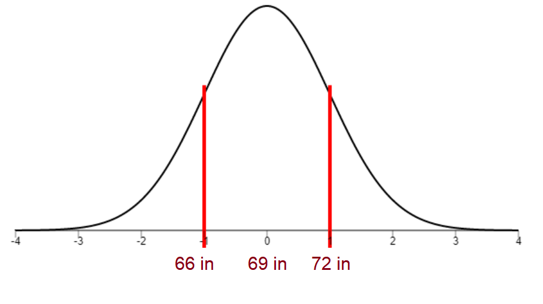
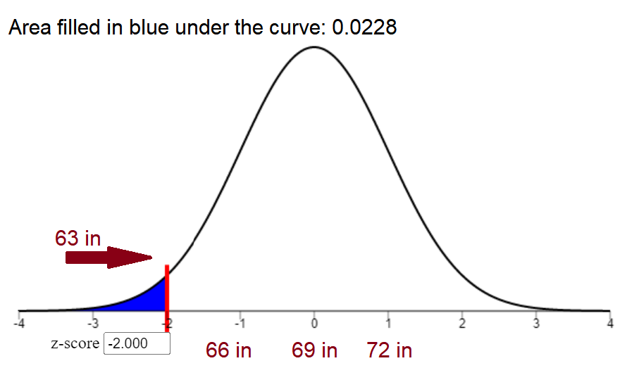
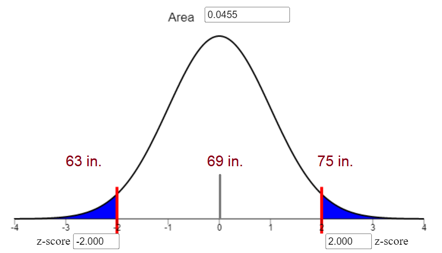
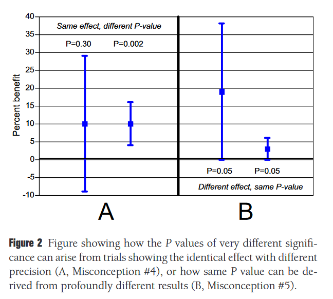
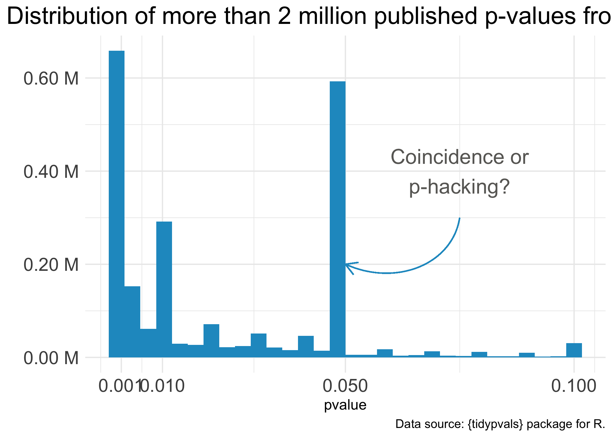

```{r setup, include=FALSE}
knitr::opts_chunk$set(echo = TRUE)
```

Work by: Aj Averett

# Ingredients

Have you ever seen these two formulas for the z score? $$
\begin{aligned}
& z = \frac{x-\mu}{\sigma} \\
& \\
& z = \frac{\bar{x}-\mu}{\left(\frac{\sigma}{\sqrt{n}}\right)}
\end{aligned}
$$ Why are these two seemingly different formulas giving the same outcome? Well let's make sure we understand what the z-score measures generally. The z-score tells us how far from typical an observation is from the average of the population.

This means that we need

-   an observation value and
-   population values (mean and standard deviation)

in order to calculate the z-score.

The difference between the two formulas is how many observations. If you just want to calculate the z-score for one guy, then use the first formula. If you want to calculate the z-score for a bunch of guys, use the second.

Technically, there is no difference between the two formulas since the average of one measurement is just itself- and the $\sqrt{n}$ will just simplify to 1 since there is only one measurement.

## Parallels of Probability

### Just one guy

**Distribution**

The average height for men in the United States is 69 inches with a standard deviation of 3 inches. Since height is normally distributed, we can imagine the population distribution as so:

### {width="375"}

Notice how I labeled what the height would be at the z scores 1 and -1 above.

**Observation**

We can also imagine Levi Ackerman compared to this population. He is 63 inches.

### {width="375"}

From this graph, if we assume the population is American adults, this would mean that the probability of finding someone as short or shorter than Levi Ackerman among American adult men would be 2.28 percent.

### A whole bunch of guys

**Distribution**

This time, we will not be using the population of American male height as the distribution. Instead, we will be using the distribution of all possible sample means. This is calculated from a population mean and standard deviation.

Uhh, what just happened? Two things:

-   We just generated a distribution from theoretical possible sample means. Yes. This is possible due to the *Central Limit Theorem*- see [here](https://www.youtube.com/watch?v=YAlJCEDH2uY) and [here](https://www.youtube.com/watch?v=Pujol1yC1_A) for some good explanations. Just for simple intuition, you are more likely to get a sample with a mean closer to the population mean than farther.

-   Notice how this assumes that the population standard deviation is known-it usually isn't

On the graph below, if the population mean is truly 69 inches, then finding samples with the means 66 and 72 would be equally likely.

### {width="375"}

**Observation**

Let us imagine a sample with the average height of 63 inches. Assuming that the distribution of theoretical sample means is correct, then the probability of us finding a sample mean as extremely small as the one below (or smaller) would be 2.28 percent.

### {width="375"}

It should be noted that (assuming the distribution of likely sample means is correct) it would be equally likely to encounter a sample with a mean of 75 inches. As seen in the chart below, this would mean that the probability of finding a sample this (or more) extreme would be 4.5 percent.

{width="369"}

## Introducing the P-value

In null hypotheses significance testing, we set up two hypotheses, the null hypothesis, and the alternative hypothesis. The process to test a hypothesis is as so:

1.  Assume the null hypothesis is true
2.  Calculate what we would expect to see if the null hypothesis is true (output is a distribution of potential test statistics)
3.  Calculate what we actually observe (output is your sample's test statistic)
4.  Using the distribution of potential test statistics, find the probability of getting your sample's test statistic
5.  If you find that the probability of you getting a test statistic is low enough according to the generated distribution of test statistics from your null hypothesis, (usually below 5 percent) reject the null hypothesis- otherwise fail to reject it.

That's it. The p-value is the probability of getting a sample as extreme or more extreme than any other result assuming your null hypothesis. As shown above, the two things you need to calculate the p-value are

-   the observed sample value (test statistic)

-   the distribution of theoretical sample values (test statistics) that could occur

Getting these two numbers depends on what type of test you are doing and what type of assumptions you are willing to make.

**The cut-off**

Now how improbably is improbable? For example, if a coin is fair and you throw it 100 times, we expect to roughly get as many heads as tails- but at what point are we going to say, "Hey this coin doesn't seem fair?" If we get 40 heads and 60 tails, this is less likely than 50 heads and 50 tails, but we can reasonably see this happening just by chance. However, if we get 75 heads and 25 tails- this would be reallllly unlikely assuming the coin is fair.

By tradition, researchers have used the arbitrary "5 percent" cutoff point to determine what is "significant" or not. If the sample's test statistic is so extreme that we would only expect the given sample to be that (or more) extreme less than 5 percent of the time, we deem it significant. \`

### Expected Data/The Distribution and Observed Data/The Test statistic

This article will not deeply go into the distributions that you may see how extreme your test statistic is, but understanding the general nature will be useful for grasping how the p-value works.

**Z-distribution**

The z-distribution, also called the normal distribution, assumes that you know the standard deviation of your population. When your sample increases, your sample's standard deviation will approach the population standard deviation. If this is the case, sufficiently large samples may assume the population standard deviation is 'known'.

**t-distribution**

Assuming the population standard deviation is not known, we may need to use the t-distribution.

The z-distribution has a set spread because we know the spread of the population. If we are unsure of the spread of the population, me may have to accept the possibility that seemingly rare events may just be results of a large spread. Now as our sample increases, we can be more sure of how the spread looks, but otherwise, we just make the distribution of test statistics wider (and therefore less sensitive to extreme findings).

What specifically determines the spread of the t-distribution is the degrees of freedom. (calculated using the sample) Since larger sample sizes approximate the spread of the data better than small ones, the distribution becomes narrower as a result of these large sample sizes.

**F-distribution**

Test statistics and distributions of test statistics come in all varieties. The F-statistic is usually used to measure if groups of variables have some relation.

-   Analysis of Variance (ANOVA) uses an F-test to measure if group means are all equal. Assuming that they are all equal, a super abnormal F-statistic would mean that either they aren't all equal or they are equal and your sample observations were just really unlikely

-   Linear Regression may use an F-test to measure if the model or any of its variables is related to the outcome. Assuming no relationship with the model or any of its variables, a super abnormal F-statistic would mean that either the model actually explains some of the model outcome, or its doesn't and the sample observations were just really unlikely.

Similar to the t-distribution, the F-distribution will change given the degrees of freedom of the sample.

**Chi-Squared (χ2) Distribution**

This distribution is similar to F-tests since it measures relationships between groups, but it does so with counts/frequencies of categorical variables rather than values or any other measurements from quantitative variables.

Like the previous distributions, the chi-squared distribution will change given the degrees of freedom of the sample

**Parametric and Non-Parametric tests**

You can calculate a p-value from anything. All you need is the distribution of what you would find theoretically given your null hypothesis, and what you have actually found. Most of the tests above are parametric tests (all but the chi squared) and therefore have various assumptions- though there are more relaxed tests that may be appropriate for various situations. Some of these are as following:

-   Wilcoxon Signed Rank test (One sample/Paired Sample t-test but non-parametric)
-   Wilcoxon Rank Sum/Mann-Whitney U test (Two Sample t-test but non-parametric)
-   Kruskal-Wallis test (ANOVA but non-parametric)

The ultimate non-parametric test is the [permutation test](https://en.wikipedia.org/wiki/Permutation_test) which makes a custom distribution of theoretical test statistics. This is only to show that the only thing one needs for a p-value is a theoretical sampling distribution of test statistics (under the null hypothesis) and the observed test statistic.

# What the p-value is NOT

**The p-value is NOT the likelihood that a result is due to chance**

"When $p$ is calculated, it is already assumed that $H_0$ is true, so the probability that sampling error is the only explanation is already taken to be [100 percent]. It is thus illogical to view $p$ as measuring the likelihood of sampling error. thus, $p$ does not apply to a particular result as the probability that sampling error was the sole causal agent. there is no such thing as a statistical technique that determines the probability that various causal factors, including sampling error, acted on a particular result. instead, inference about causation is a rational exercise that considers results within the context of design, measurement, and analysis. Besides, virtually all sample results are affected by error of some type, including measurement error."

(Kline 2013)

**The p-value is NOT the likelihood that a result is due to chance under the null hypothesis.**

"That this is not the case is seen immediately from the P value's definition, the probability of the observed data, ***plus more extreme data***, under the null hypothesis. The result with the P value of exactly .05 (or any other value) is the most probable of all the other possible results included in the "tail area" that defines the P value. The probability of any individual result is actually quite small, and Fisher said he threw in the rest of the tail area "as an approximation."

(Goodman, 2014)

**The p-value is NOT the likelihood that a Type 1 error has occurred**

"[T]he p-value represents the probability of making a Type I error *if the null hypothesis is perfectly true*...

The p-value does not give you the probability that you have made a Type I error in reality. The phrase "if the null hypothesis were perfectly true" is the key to avoiding this misinterpretation. If H0 is not an absolutely perfect statistical model for reality (perhaps because of tiny differences between group means in the population, or just because the null is completely wrong), then the probability expressed in a p-value may not be accurate ([Kirk, 1996](doi.org/10.1177/0013164496056005002)). It is still a useful statistic, however, especially because it can help us make rational decisions about how well the null hypothesis matches the data in a study ([Wasserstein & Lazar, 2016](doi.org/10.1080/00031305.2016.1154108); [Winch & Campbell, 1969](https://psycnet.apa.org/record/1969-13530-001)).

(Warne, 2017)

**The p-value is NOT the likelihood that** $H_0$ **is true**

"The $p$ value does not say anything about the probability that the null hypothesis is true because the p-value is calculated under the scenario that the null hypothesis is perfectly true ([Fidler, 2010](https://psycnet.apa.org/record/2009-18372-004)). As a result, $p$ cannot tell us whether the null hypothesis is true because we had to assume it was true in the first place to calculate $p$ ([Haller & Krauss, 2002](https://psycnet.apa.org/record/2002-14044-001)). Likewise, a p-value cannot tell us whether the alternative hypothesis is true because $p$ is based on the assumption that the null hypothesis is perfectly true."

(Warne, 2017)

$1 -$ **p-value is NOT the likelihood that the result will be replicated**

"p says very little about the replicability or stability of results ([Schmidt, 1996](doi.org/10.1037/1082-989x.1.2.115)). Indeed, p-values fluctuate wildly across studies ([Cumming, 2008](https://pubmed.ncbi.nlm.nih.gov/26158948/)). It is true, though, that (generally speaking) low p-values indicate that the null hypothesis may possibly be easier to reject in the future ([Cumming & Maillardet, 2006](doi.org/10.1037/1082-989x.11.3.217)). However, this assumes that the replications are conducted under precisely the same conditions as the original study, with every possible relevant (and irrelevant) factor perfectly replicated. In real life, a low p-value does not necessarily mean that you will get similar results if you conducted the same study again. In fact, attempts to replicate studies with low p-values often do not succeed ([Open Science Collaboration, 2015](doi.org/10.1126/science.aac4716)). If the sample size is small or if the sample is not representative of the population in some way (as occurs frequently with nonrandom samples), the results may be unstable and not replicable, even if p is very low and the null hypothesis is strongly rejected. The best way to determine whether the results of a study will replicate is to conduct a replication."

(Warne 2017)

**The p-value is NOT an indicator of how important the findings are**

The p-value says nothing about the importance of findings ([Kieffer, Reese, & Thompson, 2001](doi.org/10.1080/00220970109599489)). Remember that importance is an issue of practical significance -- not statistical significance. There is nothing magical about an α value less than .05. Decisions about policy, psychological interventions, and other practical implications of research should be based on more than just a p-value. Such important decisions should not be based on a statistic that is vulnerable to changes in sample size and study conditions ([Wasserstein & Lazar, 2016](doi.org/10.1080/00031305.2016.1154108)).

(Warne, 2017)

**The p-value is NOT an indicator about the size of an effect**

"p-values indicate the size of an effect (e.g., the difference between means or the magnitude of the relationship between variables). For example, a researcher finding that p is greater than α (indicating that the null hypothesis should be retained) may decide that the results are "insignificant" or irrelevant. This confuses p-values with effect sizes. Effect sizes quantify the strength of mean group differences or variable relationships; p-values do not ([Wasserstein & Lazar, 2016](doi.org/10.1080/00031305.2016.1154108)). If the sample size is small or the study has low statistical power, then there could be a large effect size that is worth discussing, even if p is too high to provide evidence to reject the null hypothesis... Understanding the strength of relationships or the magnitude of group differences is important -- and that is why it is essential to calculate and report an effect size to accompany a null hypothesis statistical significance test ([American Psychological Association, 2010](https://www.apa.org/pubs/books/4200066); [Wasserstein & Lazar, 2016](doi.org/10.1080/00031305.2016.1154108))."

(Warne, 2017)

{width="365"}

See more [here](https://www.ohri.ca//newsroom/seminars/SeminarUploads/1829/Suggested%20Reading%20-%20Nov%203,%202014.pdf) and [here](https://www.apa.org/pubs/books/4316151)

**The misinterpretation of p-values and its consequences have been a disaster on academia**

{width="393"}
