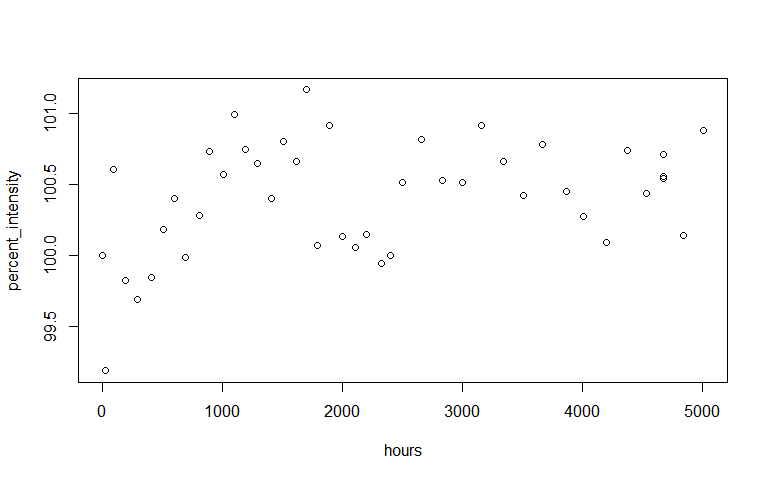

## Background Data

Throughout this project, we will analyze the brightness of LED light bulbs over time. Interestingly, LED light bulbs will increase in brightness before their steady decrease and ultimate burnout. This process may last up to three years. Since it is not feasible to test the bulb lifetime- this project will utilize mathematical models to predict the lifespan of some of these bulbs.

## Task One

In this R Markdown file, the led_bulb function will be used to generate random bulbs for predictions.


```r
library(data4led)
bulb <- led_bulb(1,seed = 196)
```

The "head" function below verifies that the data frame, bulb, includes the columns: id, hours, intensity, demonormalized_intensity, and percent_intensity.


```r
head(bulb)
```

```
##       id hours intensity normalized_intensity percent_intensity
## 5325 122     0  811.4407            1.0000000         100.00000
## 5326 122    26  804.8182            0.9918387          99.18387
## 5327 122    91  816.3557            1.0060571         100.60571
## 5328 122   192  809.9991            0.9982234          99.82234
## 5329 122   293  808.8863            0.9968521          99.68521
## 5330 122   403  810.1699            0.9984339          99.84339
```

The code below creates a plot from the bulb data frame. The plot has hours on the horizontal axis (x-axis) and percent_intensity on the vertical axis (y-axis).


```r
plot(percent_intensity ~ hours, data = bulb)
```

<!-- -->

