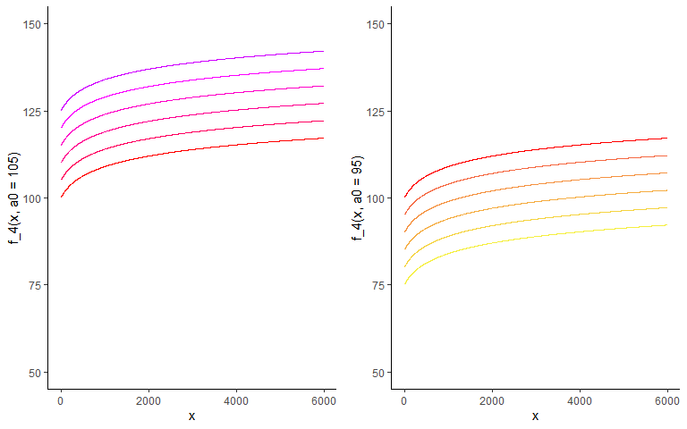
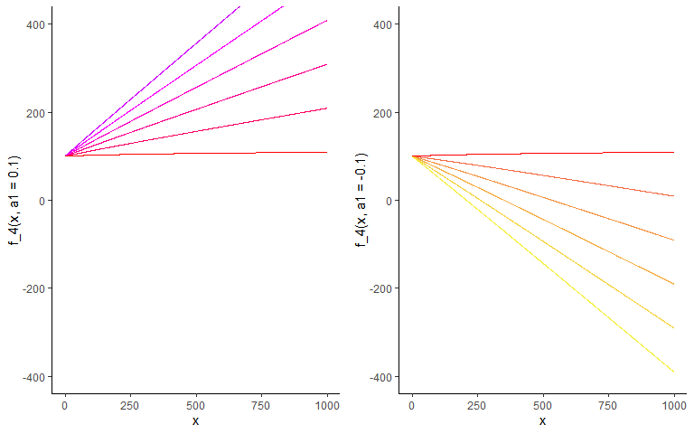

# Task Two

In this R Markdown file, the led_bulb function will be used to generate random bulbs for predictions.


```r
library(tidyverse)
library(gridExtra)  
```

# General Models

#### Function 0

$f_0(x; a_0) = a_0$ where $x \geq 0$

In this model, $a_0$ seems to vertically translate the function by specifying the y-intercept

<br>

#### Function 1

$f_1(x; a_0,a_1) = a_0 + a_1x$ where $x \geq 0$

In this model, $a_0$ seems to vertically translate the function by specifying the y-intercept

$a_1$ seems to change the slope at the y-intercept.

<br>

#### Function 2

$f_2(x; a_0,a_1,a_2) = a_0 + a_1x + a_2x^2$ where $x \geq 0$

In this model, $a_0$ seems to vertically translate the function by specifying the y-intercept

$a_1$ seems to change the slope at the y-intercept.

$a_2$ seems to horizontally stretch the function. If negative, $a_2$ seems to reflect the function over the x-axis

<br>

#### Function 3

$f_3(x; a_0,a_1,a_2 ) = a_0 + a_1e^{-a_2x}$ where $x \geq 0$

In this model, $a_0$ seems to vertically translate the function by specifying the y-intercept

$a_1$ seems to change the tail of the exponential function. If $a_1$ is negative, as x goes to infinity, y will be negative. If positive, as x goes to infinity, y will be positive.

$a_2$ seems to horizontally stretch the function. If negative, $a_2$ seems to reflect the function over the y-axis

<br>

#### Function 4

$f_4(x; a_0,a_1,a_2) = a_0 + a_1x + a_2\ln(0.005x+1)$ where $x \geq 0$

In this model, $a$ seems to vertically translate the function by specifying the y-intercept

$b$ seems to change the slope at the y-intercept. If $b$ is negative, as x goes to infinity, y will be negative. If positive, as x goes to infinity, y will be positive. 

$c$ will vertically stretch the function. If negative, the function will vertically reflect over the x-axis. 

<br>

#### Function 5

$f_5(x; a_0,a_1,a_2) = (a_0+a_1x)e^{-a_2x}$ where $x \geq 0$

In this model, $a_0$ seems to vertically manipulate the function by specifying the y-intercept. While some of the function will translate, the end behavior of the function will remain constant

$a_1$ seems to vertically stretch the function. If negative, $a_1$ will vertically reflect over where $a_0$ is at.

$a_2$ seems to horizontally change the end behaviors of the function. If $a_1$ and $a_2$ is positive, each end will display in quadrant 1 and 3. If both negative, the ends will display in quadrant 2 and 4.

<br>


# Visual Exploratory Analysis

_Parameter Exploration for $f_3(x)$ and $f_4(x)$_


## Function 3

$f_3(x; a_0,a_1,a_2 ) = a_0 + a_1e^{-a_2x}$ where $x \geq 0$

### Manipulating $a_0$ for $f_3$

In this model, $a_0$ seems to vertically translate the function by specifying the y-intercept


```r
x <- (0:6000)

f_3 <- function(x, a0 = 0, a1 = 1, a2 = -0.001){
  a0 + a1*exp(-a2*x)
}

f_3a <- ggplot() + 
   geom_line(aes(x = x, y = f_3(x, a0 = 20)), color = '#ff0060') +
   geom_line(aes(x = x, y = f_3(x, a0 = 40)), color = '#ff0090') +
   geom_line(aes(x = x, y = f_3(x, a0 = 60)), color = '#ff00c8') +
   geom_line(aes(x = x, y = f_3(x, a0 = 80)), color = '#fb00ff') +
   geom_line(aes(x = x, y = f_3(x, a0 = 100)), color = '#d000ff') +
   geom_line(aes(x = x, y = f_3(x)), color = '#ff0000') +
   theme_classic() +
   coord_cartesian(xlim = c(0,6000), ylim = c(-100,500))


f_3b <- ggplot() + 
   geom_line(aes(x = x, y = f_3(x, a0 = -20)), color = '#f56942') +
   geom_line(aes(x = x, y = f_3(x, a0 = -40)), color = '#f59342') +
   geom_line(aes(x = x, y = f_3(x, a0 = -60)), color = '#f5ad42') +
   geom_line(aes(x = x, y = f_3(x, a0 = -80)), color = '#f5d442') +
   geom_line(aes(x = x, y = f_3(x, a0 = -100)), color = '#f5ef42') +
   geom_line(aes(x = x, y = f_3(x)), color = '#ff0000') +
   theme_classic() +
   coord_cartesian(xlim = c(0,6000), ylim = c(-100,500))

grid.arrange(f_3a, f_3b, ncol = 2)
```

<!-- -->
<br>

For function three, the red instantiation represents $a_0$ at 0. More purple lines represent $a_0$ increasing positively with more yellow lines decreasing negatively.

<br>

### Manipulating $a_01$ for $f_3$


$a_1$ seems to change the tail of the exponential function. If $a_1$ is negative, as x goes to infinity, y will be negative. If positive, as x goes to infinity, y will be positive.

<br>


```r
x <- (0:6000)

f_3 <- function(x, a0 = 0, a1 = 0, a2 = -0.001){
  a0 + a1*exp(-a2*x)
}

f_3c <- ggplot() + 
   geom_line(aes(x = x, y = f_3(x, a1 = 0.5)), color = '#ff0060') +
   geom_line(aes(x = x, y = f_3(x, a1 = 1)), color = '#ff0090') +
   geom_line(aes(x = x, y = f_3(x, a1 = 1.5)), color = '#ff00c8') +
   geom_line(aes(x = x, y = f_3(x, a1 = 2)), color = '#fb00ff') +
   geom_line(aes(x = x, y = f_3(x, a1 = 2.5)), color = '#d000ff') +
   geom_line(aes(x = x, y = f_3(x)), color = '#ff0000') +
   theme_classic() +
   coord_cartesian(xlim = c(0,6000), ylim = c(-500,500))

f_3d <- ggplot() + 
   geom_line(aes(x = x, y = f_3(x, a1 = -0.5)), color = '#f56942') +
   geom_line(aes(x = x, y = f_3(x, a1 = -1)), color = '#f59342') +
   geom_line(aes(x = x, y = f_3(x, a1 = -1.5)), color = '#f5ad42') +
   geom_line(aes(x = x, y = f_3(x, a1 = -2)), color = '#f5d442') +
   geom_line(aes(x = x, y = f_3(x, a1 = -2.5)), color = '#f5ef42') +
   geom_line(aes(x = x, y = f_3(x)), color = '#ff0000') +
   theme_classic() +
   coord_cartesian(xlim = c(0,6000), ylim = c(-500,500))

grid.arrange(f_3c, f_3d, ncol = 2)
```

<!-- -->
<br>

For function three, the red instantiation represents $a_1$ at 0. More purple lines represent $a_1$ increasing positively with more yellow lines decreasing negatively.


<br>

### Manipulating $a_2$ for $f_3$

 
$a_2$ seems to horizontally stretch the function. If negative, $a_2$ seems to reflect the function over the y-axis

<br>


```r
x <- (0:6000)

f_3 <- function(x, a0 = 0, a1 = 1, a2 = 0){
  a0 + a1*exp(-a2*x)
}

f_3e <- ggplot() + 
   geom_line(aes(x = x, y = f_3(x, a2 = 0.0001)), color = '#ff0060') +
   geom_line(aes(x = x, y = f_3(x, a2 = 0.0002)), color = '#ff0090') +
   geom_line(aes(x = x, y = f_3(x, a2 = 0.0003)), color = '#ff00c8') +
   geom_line(aes(x = x, y = f_3(x, a2 = 0.0004)), color = '#fb00ff') +
   geom_line(aes(x = x, y = f_3(x, a2 = 0.0005)), color = '#d000ff') +
   geom_line(aes(x = x, y = f_3(x)), color = '#ff0000') +
   theme_classic() +
   coord_cartesian(xlim = c(0,6000), ylim = c(0,10))

f_3f <- ggplot() + 
   geom_line(aes(x = x, y = f_3(x, a2 = -0.0001)), color = '#f56942') +
   geom_line(aes(x = x, y = f_3(x, a2 = -0.0002)), color = '#f59342') +
   geom_line(aes(x = x, y = f_3(x, a2 = -0.0003)), color = '#f5ad42') +
   geom_line(aes(x = x, y = f_3(x, a2 = -0.0004)), color = '#f5d442') +
   geom_line(aes(x = x, y = f_3(x, a2 = -0.0005)), color = '#f5ef42') +
   geom_line(aes(x = x, y = f_3(x)), color = '#ff0000') +
   theme_classic() +
   coord_cartesian(xlim = c(0,6000), ylim = c(0,10))

grid.arrange(f_3e, f_3f, ncol = 2)   
```

<!-- -->

<br>

For function three, the red instantiation represents $a_2$ at 0. More purple lines represent $a_2$ increasing positively with more yellow lines decreasing negatively.

<br>


## Function 4

$f_4(x; a_0,a_1,a_2) = a_0 + a_1x + a_2\ln(0.005x+1)$ where $x \geq 0$

### Manipulating $a_0$ for $f_4$


In this model, $a_0$ seems to vertically translate the function by specifying the y-intercept


```r
x <- (0:6000)

f_4 <- function(x, a0 = 100, a1 = 0, a2 = 5){
  a0 + a1 + a2*log(0.005*x + 1)
}
f_4a <- ggplot() + 
   geom_line(aes(x = x, y = f_4(x, a0 = 105)), color = '#ff0060') +
   geom_line(aes(x = x, y = f_4(x, a0 = 110)), color = '#ff0090') +
   geom_line(aes(x = x, y = f_4(x, a0 = 115)), color = '#ff00c8') +
   geom_line(aes(x = x, y = f_4(x, a0 = 120)), color = '#fb00ff') +
   geom_line(aes(x = x, y = f_4(x, a0 = 125)), color = '#d000ff') +
   geom_line(aes(x = x, y = f_4(x)), color = '#ff0000') +
   theme_classic() +
   coord_cartesian(xlim = c(0,6000), ylim = c(50,150))

f_4b <- ggplot() + 
   geom_line(aes(x = x, y = f_4(x, a0 = 95)), color = '#f56942') +
   geom_line(aes(x = x, y = f_4(x, a0 = 90)), color = '#f59342') +
   geom_line(aes(x = x, y = f_4(x, a0 = 85)), color = '#f5ad42') +
   geom_line(aes(x = x, y = f_4(x, a0 = 80)), color = '#f5d442') +
   geom_line(aes(x = x, y = f_4(x, a0 = 75)), color = '#f5ef42') +
   geom_line(aes(x = x, y = f_4(x)), color = '#ff0000') +
   theme_classic() +
   coord_cartesian(xlim = c(0,6000), ylim = c(50,150))

grid.arrange(f_4a, f_4b, ncol = 2)   
```

<!-- -->

For function three, the red instantiation represents $a_0$ at 100. More purple lines represent $a_0$ increasing positively with more yellow lines decreasing negatively.

<br>

### Manipulating $a_1$ for $f_4$


$a_1$ seems to change the slope at the y-intercept. If $a_1$ is negative, as x goes to infinity, y will be negative. If positive, as x goes to infinity, y will be positive. 

<br>


```r
x <- (0:1000)

f_4 <- function(x, a0 = 100, a1 = 0, a2 = 5){
  a0 + a1*x + a2*log(0.005*x + 1)
}
f_4c <- ggplot() + 
   geom_line(aes(x = x, y = f_4(x, a1 = .1)), color = '#ff0060') +
   geom_line(aes(x = x, y = f_4(x, a1 = .2)), color = '#ff0090') +
   geom_line(aes(x = x, y = f_4(x, a1 = .3)), color = '#ff00c8') +
   geom_line(aes(x = x, y = f_4(x, a1 = .4)), color = '#fb00ff') +
   geom_line(aes(x = x, y = f_4(x, a1 = .5)), color = '#d000ff') +
   geom_line(aes(x = x, y = f_4(x)), color = '#ff0000') +
   theme_classic() +
   coord_cartesian(xlim = c(0,1000), ylim = c(-400,400))

f_4d <- ggplot() + 
   geom_line(aes(x = x, y = f_4(x, a1 = -0.1)), color = '#f56942') +
   geom_line(aes(x = x, y = f_4(x, a1 = -0.2)), color = '#f59342') +
   geom_line(aes(x = x, y = f_4(x, a1 = -0.3)), color = '#f5ad42') +
   geom_line(aes(x = x, y = f_4(x, a1 = -0.4)), color = '#f5d442') +
   geom_line(aes(x = x, y = f_4(x, a1 = -0.5)), color = '#f5ef42') +
   geom_line(aes(x = x, y = f_4(x)), color = '#ff0000') +
   theme_classic() +
   coord_cartesian(xlim = c(0,1000), ylim = c(-400,400))

grid.arrange(f_4c, f_4d, ncol = 2)   
```

<!-- -->

For function three, the red instantiation represents $a_1$ at 0. More purple lines represent $a_1$ increasing positively with more yellow lines decreasing negatively.

<br>


### Manipulating $a_2$ for $f_4$

$a_2$ will vertically stretch the function. If negative, the function will vertically reflect over the x-axis. 

<br>


```r
x <- (0:1000)

f_4 <- function(x, a0 = 100, a1 = 0, a2 = 0){
  a0 + a1*x + a2*log(0.005*x + 1)
}


f_4e <- ggplot() + 
   geom_line(aes(x = x, y = f_4(x, a2 = 1)), color = '#ff0060') +
   geom_line(aes(x = x, y = f_4(x, a2 = 2)), color = '#ff0090') +
   geom_line(aes(x = x, y = f_4(x, a2 = 3)), color = '#ff00c8') +
   geom_line(aes(x = x, y = f_4(x, a2 = 4)), color = '#fb00ff') +
   geom_line(aes(x = x, y = f_4(x, a2 = 5)), color = '#d000ff') +
   geom_line(aes(x = x, y = f_4(x)), color = '#ff0000') +
   theme_classic() +
   coord_cartesian(xlim = c(0,1000), ylim = c(90,110))

f_4f <- ggplot() + 
   geom_line(aes(x = x, y = f_4(x, a2 = -1)), color = '#f56942') +
   geom_line(aes(x = x, y = f_4(x, a2 = -2)), color = '#f59342') +
   geom_line(aes(x = x, y = f_4(x, a2 = -3)), color = '#f5ad42') +
   geom_line(aes(x = x, y = f_4(x, a2 = -4)), color = '#f5d442') +
   geom_line(aes(x = x, y = f_4(x, a2 = -5)), color = '#f5ef42') +
   geom_line(aes(x = x, y = f_4(x)), color = '#ff0000') +
   theme_classic() +
   coord_cartesian(xlim = c(0,1000), ylim = c(90,110))

grid.arrange(f_4e, f_4f, ncol = 2)   
```

<!-- -->

<br>

For function three, the red instantiation represents $a_2$ at 0. More purple lines represent $a_2$ increasing positively with more yellow lines decreasing negatively.
