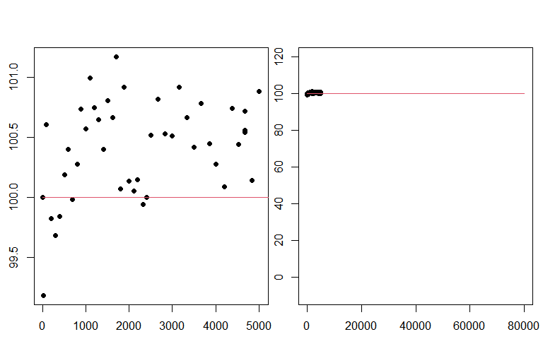
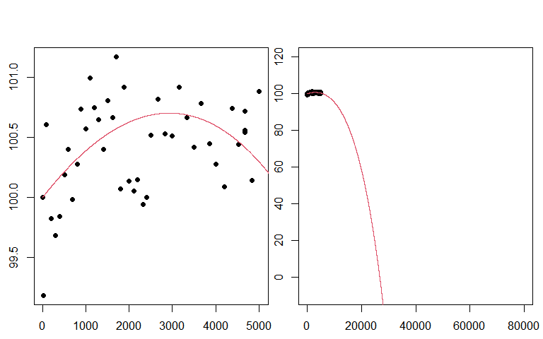

# Task Three

# Background

LED bulb data is collected for the first few thousand hours in which intensity is measured as a percent of the original measurement. Therefore, the first measurement will be 100 percent tautologically. In order to predict the lifespan of these bulbs, we can use various types of models to represent the intensity over time. Below is the data for the LED intensity.


```r
library(data4led)
bulb <- led_bulb(1,seed = 196)

t <- bulb$hours
y1 <- bulb$percent_intensity

par(mfrow = c(1,2),mar = c(2,2,3,0.25),oma = rep(0.5,4))
plot(t,y1,xlab = "Hour ", ylab = "Intensity(%) ", pch = 16,main = '')
#lines(x,yM,col = 2)
plot(t,y1,xlab = "Hour ", ylab = "Intensity(%) ", pch = 16, xlim  =  c(-10,80000),ylim  =  c(-10,120))
```

<!-- -->

```r
#lines(x,yM,col = 2)

x <- 0:80000
```

# Functions as lightbulb intensity models

## Function Zero
$f_0(t; a_0)  =  a_0$ where $t \geq 0$

Given the function above, in order to make the model visually accurate, the parameters specified in the function must be values that allow the above to be so. For example, since $f_0(x)$ must be equal to 100, $a_0$ is set to "100".


```r
# f_0(t; a_0)  =  a_0
f_0 <- function(t, a0 = 100){
  a0 + t*0  
}

par(mfrow = c(1,2),mar = c(2,2,3,0.25),oma = rep(0.5,4))
plot(t,y1,xlab = "Hour ", ylab = "Intensity(%) ", pch = 16,main = '')
lines(x,f_0(x),col = 2)
plot(t,y1,xlab = "Hour ", ylab = "Intensity(%) ", pch = 16, xlim  =  c(-10,80000),ylim  =  c(-10,120))
lines(x,f_0(x),col = 2)
```

<!-- -->

## Function One
$f_1(t; a_0,a_1)  =  a_0 + a_1t$ where $t \geq 0$

Given the function above, in order to make the model visually accurate, the parameters specified in the function must be values that allow the above to be so. For example, since $f_1(x)$ must be equal to 100, $a_0$ is set to "100".

$a_1$ is set to the positive value, "0.00015" since the curve of the LED data seems to be positive 


```r
# f_1(t; a_0,a_1)  =  a_0 + a_1t
f_1 <- function(t, a0  =  100, a1  =  0.00015){
  a0 + a1*t
}

par(mfrow = c(1,2),mar = c(2,2,3,0.25),oma = rep(0.5,4))
plot(t,y1,xlab = "Hour ", ylab = "Intensity(%) ", pch = 16,main = '')
lines(x,f_1(x),col = 2)
plot(t,y1,xlab = "Hour ", ylab = "Intensity(%) ", pch = 16, xlim  =  c(-10,80000),ylim  =  c(-10,120))
lines(x,f_1(x),col = 2)
```

<!-- -->

## Function Two
$f_2(t; a_0,a_1)  =  a_0 + a_1t$ where $t \geq 0$

Given the function above, in order to make the model visually accurate, the parameters specified in the function must be values that allow the above to be so. For example, since $f_2(x)$ must be equal to 100, $a_0$ is set to "100".

$a_1$ and $a_2$ are set as "0.00035" and "-0.00000005" respectively such that the curve visually matches the data. Since $a_2$ changes whether the parabola opens up or down, this is set to negative such that as the value of x increases, the value of y will first increase, then decrease.


```r
# f_2(t; a_0,a_1)  =  a_0 + a_1t
f_2 <- function(t, a0  =  100, a1  =  0.00035, a2  =  -0.00000005){
  a0 + a1*t + a2*t^2
}

par(mfrow = c(1,2),mar = c(2,2,3,0.25),oma = rep(0.5,4))
plot(t,y1,xlab = "Hour ", ylab = "Intensity(%) ", pch = 16,main = '')
lines(x,f_2(x),col = 2)
plot(t,y1,xlab = "Hour ", ylab = "Intensity(%) ", pch = 16, xlim  =  c(-10,80000),ylim  =  c(-10,120))
lines(x,f_2(x),col = 2)
```

<!-- -->

## Function Three
$f_3(t; a_0,a_1,a_2 )  =  a_0 + a_1e^{-a_2t}$ where $t \geq 0$

Given the function above, in order to make the model visually accurate, the parameters specified in the function must be values that allow the above to be so. Since $a_1$ and $a_2$ are "-0.77" and "0.0005" respectively, $a_0$ is set to "100.77" so that $f_3(x)$ is equal to 100. $a_1$ and $a_2$ are set as such that the curve visually matches the data. $a_1$ is set to a negative value, "-0.77" to reflect the fact that as the value of x decreases, $f_3(x)$ decreases as well. Finally, $a_2$ is set to "0.0005" to refine the intensity of the curve.


```r
# f_3(t; a_0,a_1,a_2 )  =  a_0 + a_1e^{-a_2t}
f_3 <- function(t, a0  =  100.77, a1  =  -0.77, a2  =  0.0005){
  a0 + a1*exp(-a2*t)
}

par(mfrow = c(1,2),mar = c(2,2,3,0.25),oma = rep(0.5,4))
plot(t,y1,xlab = "Hour ", ylab = "Intensity(%) ", pch = 16,main = '')
lines(x,f_3(x),col = 2)
plot(t,y1,xlab = "Hour ", ylab = "Intensity(%) ", pch = 16, xlim  =  c(-10,80000),ylim  =  c(-10,120))
lines(x,f_3(x),col = 2)
```

<!-- -->

## Function Four
$f_4(t; a_0,a_1,a_2)  =  a_0 + a_1t + a_2\ln(0.005t+1)$ where $t \geq 0$

Given the function above, in order to make the model visually accurate, the parameters specified in the function must be values that allow the above to be so. For example, since $f_4(x)$ must be equal to 100, $a_0$ is set to "100".

$a_1$ and $a_2$ are set as "0.000005" and "0.14" respectively such that the curve visually matches the data. $a_1$ is set to a positive value so that as the x value increases, $f_4(x)$ increases. $a_2$ is set to a positive value so that as the the x value decreases, $f_4(x)$ decreases.


```r
# f_4(t; a_0,a_1,a_2)  =  a_0 + a_1t + a_2\ln(0.005t+1)
f_4 <- function(t, a0  =  100, a1  =  0.000005, a2  =  0.14){
  a0 + a1*t + a2*log(0.005*t + 1)
}

par(mfrow = c(1,2),mar = c(2,2,3,0.25),oma = rep(0.5,4))
plot(t,y1,xlab = "Hour ", ylab = "Intensity(%) ", pch = 16,main = '')
lines(x,f_4(x),col = 2)
plot(t,y1,xlab = "Hour ", ylab = "Intensity(%) ", pch = 16, xlim  =  c(-10,80000),ylim  =  c(-10,120))
lines(x,f_4(x),col = 2)
```

<!-- -->

## Function Five
$f_5(t; a_0,a_1,a_2) = (a_0+a_1t)e^{-a_2t}$ where $t \geq 0$

Given the function above, in order to make the model visually accurate, the parameters specified in the function must be values that allow the above to be so. For example, since $f_5(x)$ must be equal to 100, $a_0$ is set to "100".

$a_1$ and $a_2$ are set as "-0.00374" and "-0.000042" respectively such that the curve visually matches the data. $a_1$ and $a_2$ play off each other such that as these values approach zero together, their curve becomes less intense and wider. 


```r
# f_5(t; a_0,a_1,a_2) = (a_0+a_1t)e^{-a_2t}
f_5 <- function(t, a0 = 100, a1 = -0.00374, a2 = -0.000042){
  (a0 + a1*t)*exp(-a2*t)
}

par(mfrow = c(1,2),mar = c(2,2,3,0.25),oma = rep(0.5,4))
plot(t,y1,xlab = "Hour ", ylab = "Intensity(%) ", pch = 16,main = '')
lines(x,f_5(x),col = 2)
plot(t,y1,xlab = "Hour ", ylab = "Intensity(%) ", pch = 16, xlim = c(-10,80000),ylim = c(-10,120))
lines(x,f_5(x),col = 2)
```

<!-- -->

# Checking if $f_i(0) = 100$ where $i$ refers to $f_0$ to $f_5$. 


```{.r .fold-show}
f_0(0)
```

```
## [1] 100
```

```{.r .fold-show}
f_1(0)
```

```
## [1] 100
```

```{.r .fold-show}
f_2(0)
```

```
## [1] 100
```

```{.r .fold-show}
f_3(0)
```

```
## [1] 100
```

```{.r .fold-show}
f_4(0)
```

```
## [1] 100
```

```{.r .fold-show}
f_5(0)
```

```
## [1] 100
```


## Models versus reality

* $f_0$

The model says that the lightbulb will stay at the same intensity forever

* $f_1$

The model says that the lightbulb will increase intensity forever (scary!)

* $f_2$

The model says that the lightbulb will increase slightly in intensity and then decrease

* $f_3$

The model says that the lightbulb will increase slightly in intensity and then remain at that intensity forever

* $f_4$

The model says that the lightbulb will increase slightly in intensity and then remain at that intensity forever

* $f_5$

The model says that the lightbulb will increase slightly in intensity and then decrease

Almost all the models presented do not conform to reality. $f_0$, $f_1$, $f_3$, and $f_4$ all do not decrease as $t$, time, increases. $f_1$, in fact, increases as time increases unlike the above models which continually stay stagnant. $f_2$ and $f_5$ decrease after increasing slightly- similar to the behavior of LED's. More detail is given below
